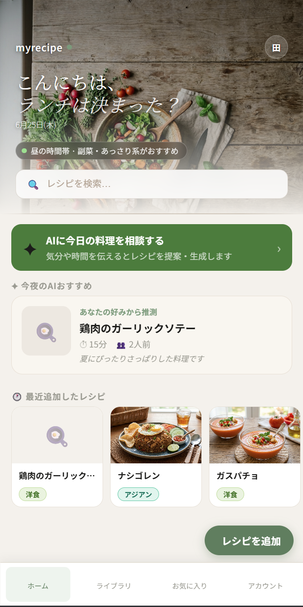
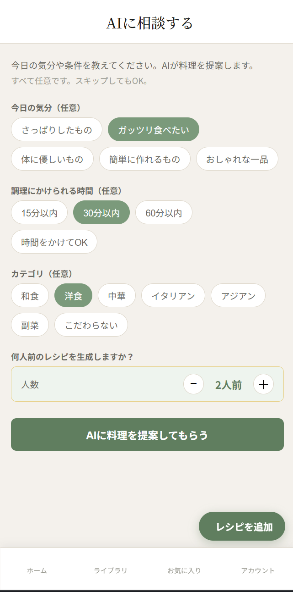
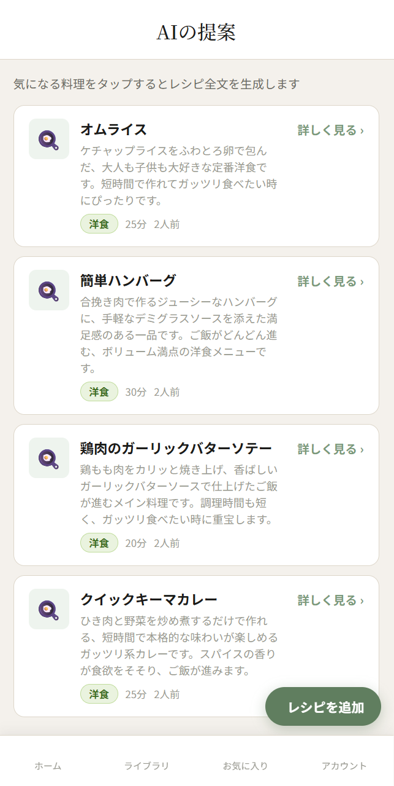
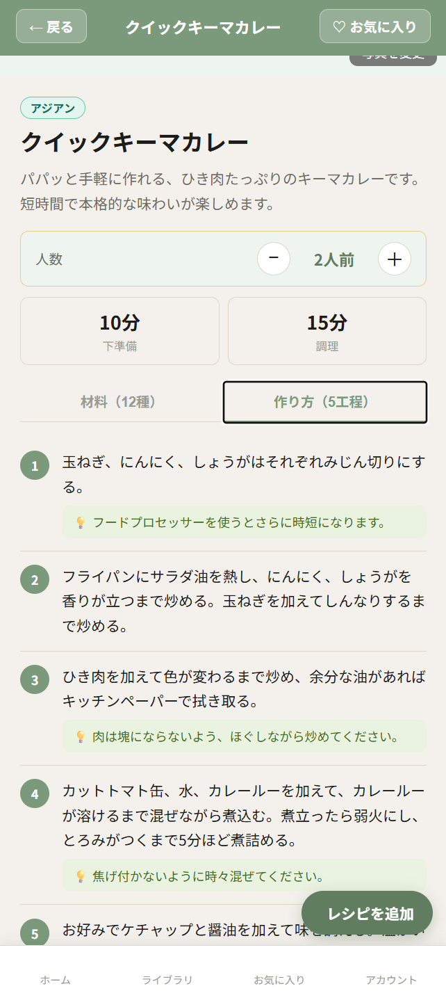

# MyRecipeBook

**自分だけのオリジナルレシピをデジタルで管理する、シンプルで賢いWebアプリ。**

料理写真・材料・手順をまとめて保存し、人数に合わせた分量自動計算・AIアシスタントによる料理サポートを提供します。v4.5では、AIレシピ生成機能の完全動作化・保存フローの安定化・UIの視覚的統一を実施し、Gemini APIを活用したレシピ生成体験を実用レベルに引き上げました。

<br>

## スクリーンショット

| ホーム | 要望の選択 |
|:---:|:---:|
|  |  |

| AIの提案 | レシピ詳細（材料・手順） |
|:---:|:---:|
|  |  |

<br>

---

## v4.5 アップデート内容

v4.4（Phase 2）では認証基盤・PWA対応・レシピ共有機能を実装し、マルチユーザー対応の土台を整えました。一方で、コア機能であるAIレシピ生成について、生成したレシピの材料・手順がDBに保存されない・フロントエンドに表示されないという根本的な不具合が残っていました。

v4.5では、この不具合を起点にバックエンドからフロントエンドまでの全層を精査し、AIレシピ生成・保存・表示フローを完全に動作する状態に修正しています。あわせてUIの視覚的な統一も実施しました。

<br>

### 1. AIレシピ生成の保存不具合を修正

**症状:** AIが生成したレシピのタイトル・概要は表示・保存されるが、材料・手順が空のまま保存される。

**原因:** `main.py` の起動時マイグレーション処理に `ingredients` / `steps` カラムの追加処理が含まれていなかった。`models.py` では `JSON` 型として正しく定義されていたが、既存DBには該当カラムが存在せず、保存・読み込みがサイレントに無視されていた。

```
Base.metadata.create_all()  →  新規DB作成時のみ正しく作られる
既存DB           →  ingredientsカラムが存在しないため保存されない（エラーも出ない）
```

**修正内容:** `main.py` に `_migrate_add_ingredients_steps()` を追加し、起動時に自動でカラムを付与するようにした。

```python
def _migrate_add_ingredients_steps():
    for column_def in (
        "ingredients JSON DEFAULT '[]'",
        "steps       JSON DEFAULT '[]'",
    ):
        cur.execute(f"ALTER TABLE recipes ADD COLUMN {column_def}")
```

<br>

### 2. レシピ保存時の422エラーを修正

**症状:** AIレシピ生成後に「ライブラリに保存」を押すと `422 Unprocessable Entity` が返り、保存できない。

**原因:** Geminiが「適量」などの単位を持たない食材に対して `unit: null` を返すケースがあるが、`routers/schemas.py` の `IngredientIn.unit` が `str`（必須）として定義されていたため、Pydanticのバリデーションで弾かれていた。

```python
# 修正前
unit: str = ""          # null を受け付けない

# 修正後
unit: Optional[str] = ""  # null を受け取り空文字として扱う
```

<br>

### 3. Gemini画像生成のコメントアウト実装

**目的:** ポートフォリオとして「画像生成まで設計済み」であることを示しつつ、無料枠運用環境でのコスト発生を防ぐ。

`gemini_client.py` の `generate_recipe()` 末尾に Imagen 3 による画像生成コードをコメントアウトで追加した。`base.py` の `GeneratedRecipe` に `image_url: Optional[str] = None` フィールドも追加済みのため、本番運用時はコメントアウトを解除するだけで画像生成からフロントエンドへの受け渡しまでが動作する状態になっている。

```python
# ── 画像生成（本番運用時に有効化） ──────────────────
# Imagen 3 を使ってレシピ画像を生成する。
# 無料枠なし・1枚あたり約$0.03のため、ポートフォリオ環境では無効化中。
#
# image_response = self._client.models.generate_images(
#     model="imagen-3.0-generate-002",
#     prompt=f"日本の家庭料理「{data['title']}」の美しい料理写真、自然光、白い皿",
#     config=types.GenerateImagesConfig(
#         number_of_images=1,
#         aspect_ratio="4:3",
#     ),
# )
```

<br>

### 4. UIの視覚的統一

**「AIの提案」ヘッダーのタイトルずれを修正**

`DiscoverPage.jsx` の RESULTS ステップにおいて、「← 条件を変える」ボタンの文字数が多いため右側のダミー幅との非対称が生じ、タイトルが右にずれていた。タイトルを `position: absolute / left: 50% / translateX(-50%)` で絶対配置し、ボタン幅に依存せず常に中央に表示されるよう修正した。

**ホームのAIバナー色をアプリトーンに統一**

ホーム画面の「AIに今日の料理を相談する」バナーが青紫（`#6D28D9`）だったため、アプリ全体のベージュ・グリーン・ゴールド系のトーンから浮いていた。「レシピを追加」ボタンと同色の `#4a7c35`（ダークグリーン）に統一した。

<br>

---

## 技術スタック

- **フロントエンド**: React 18.3 / React Router v6 / Vite 5.4 / Axios 1.7 / vite-plugin-pwa
- **バックエンド**: FastAPI 0.115 / SQLAlchemy 2.0 / Pydantic v2 / SQLite
- **認証**: passlib（bcrypt） / python-jose（JWT）
- **AI・データ**: ChromaDB / Google Gemini API（gemini-2.5-flash）/ Imagen 3（コメントアウト済み）

<br>

---

## 変更ファイル一覧（v4.4 → v4.5）

### バックエンド

| ファイル | 変更内容 |
|---|---|
| `main.py` | `_migrate_add_ingredients_steps()` を追加。起動時に `ingredients` / `steps` カラムを既存DBに自動付与 |
| `routers/schemas.py` | `IngredientIn.unit` を `str` → `Optional[str]` に変更。Geminiが返す `null` を許容 |
| `services/ai/base.py` | `GeneratedRecipe` に `image_url: Optional[str] = None` を追加 |
| `services/ai/gemini_client.py` | `generate_recipe()` 末尾に Imagen 3 画像生成コードをコメントアウトで追加 |

### フロントエンド

| ファイル | 変更内容 |
|---|---|
| `pages/DiscoverPage.jsx` | RESULTSステップのヘッダータイトルを絶対配置で中央固定 |
| `pages/HomePage.jsx` | AIバナー背景色を `#6D28D9`（青紫）→ `#4a7c35`（ダークグリーン）に変更 |

<br>

---

## 既知の課題と対応状況

**RAGの検索精度はレシピ数に依存する（v4.0.1から継続）**

`n_results=4` の指定により、登録レシピが4件未満の場合は類似検索がヒットしない場合があります。10件以上の登録を推奨します。

**メール確認（verification）は未実装**

現在の新規登録は「登録した瞬間にログイン状態になる」簡易フローです。本番運用する場合はメール送信サービスとの連携が今後必要です。

**v4.5以前に保存済みのレシピは材料・手順が空**

マイグレーション適用前に保存されたレシピは `ingredients` / `steps` が空のままです。該当レシピは編集画面から手動で入力するか、AIで再生成・再保存してください。

**レシピ画像は未生成（ポートフォリオ環境）**

Imagen 3 による画像生成は `gemini_client.py` にコメントアウトで実装済みです。本番運用時はコメントアウトを解除し、画像保存先（S3等）を設定することで有効化できます。

<br>

---

## ローカル起動手順

v4.4からの変更点はありません。

```powershell
# ターミナル 1（バックエンド）
cd backend
venv/Scripts/activate
uvicorn main:app --reload

# ターミナル 2（フロントエンド）
cd frontend
npm run dev
```

起動時に `ingredients` / `steps` カラムのマイグレーションが自動実行されます。手動でのSQL操作は不要です。

<br>

---

## 次期アップデートについて

v4.0.1でテスト実装したRAGの `references` フィールドを活用し、フロントエンドのAIパネルに「このレシピを参照しました」という根拠表示を追加予定です。また、Imagen 3 による画像生成の本番有効化・フォーク数の表示・通知設定の実装も検討しています。

<br>

---

## 開発者について

フルスタック開発・AI連携・認証基盤・UXデザインの実践的な学習を目的に制作している個人開発プロジェクトです。

技術的な質問・フィードバック・コラボレーションのご提案は Issue または Discussions からどうぞ。

<br>

---

## ライセンス

MIT License — 詳細は [LICENSE](LICENSE) をご覧ください。
