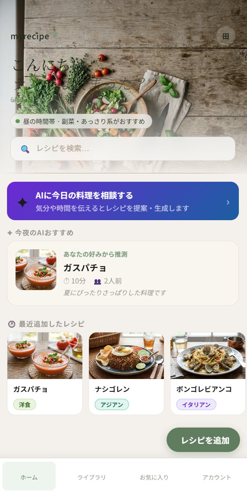
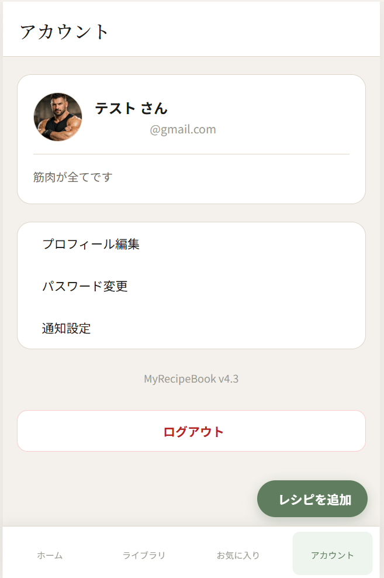
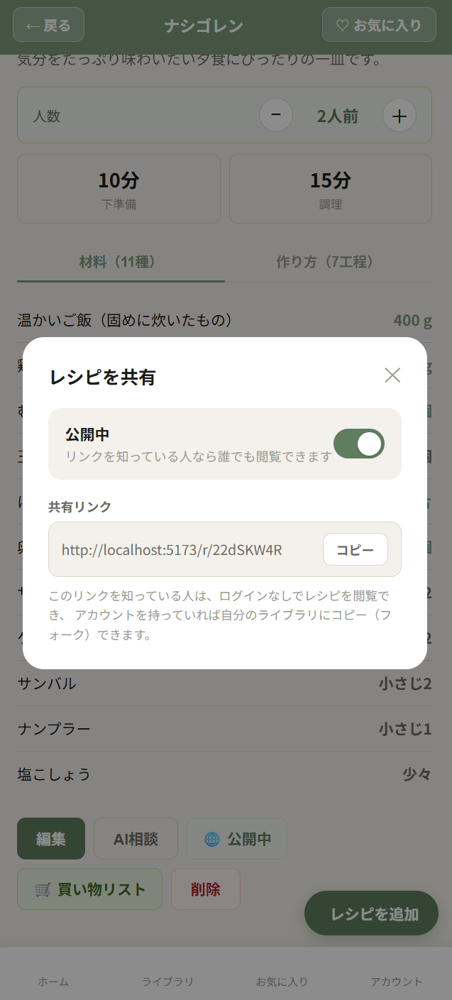
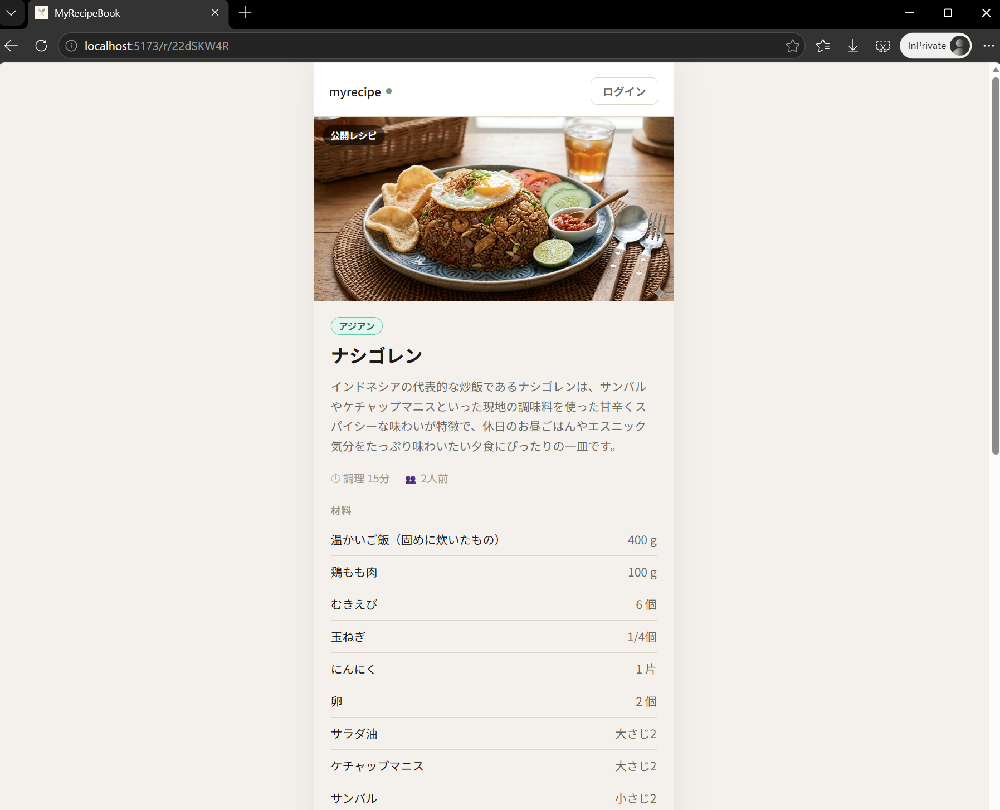

# MyRecipeBook

**自分だけのオリジナルレシピをデジタルで管理する、シンプルで賢いWebアプリ。**

料理写真・材料・手順をまとめて保存し、人数に合わせた分量自動計算・AIアシスタントによる料理サポートを提供します。v4.4（Phase 2）では、PWA対応・ユーザー認証基盤・レシピ共有機能を実装し、個人のメモアプリから「複数人で使えるサービス」への土台を整えました。

<br>

## スクリーンショット

| ホーム | アカウント |
|:---:|:---:|
|  |  |

| レシピ共有（公開設定） | 公開レシピ閲覧（未ログイン） |
|:---:|:---:|
|  |  |

<br>

---

## v4.4 アップデート内容

v4.0.1 では UI 全面刷新と RAG 導入テストを行いましたが、アプリは依然として「ログイン不要の単一ユーザー向けツール」でした。v4.4（Phase 2）では、認証基盤を新たに構築し、PWA化・アカウント管理・レシピ共有という3つの大きな機能を段階的に積み重ねています。

開発はバックエンドの `/health` エンドポイントが報告するバージョンに沿って、以下の順序で進めました。

```
v4.1  PWA対応
v4.2  ユーザー認証基盤（JWT・ログイン/ログアウト・権限分離）
v4.3  アカウント管理（プロフィール編集・パスワード変更）
v4.4  レシピ共有・フォーク機能
```

<br>

### 1. PWA（Progressive Web App）対応

**想定ユースケース:** 「ブラウザのブックマークではなく、スマホのホーム画面からアプリのように起動したい」「電波が不安定な場所でも保存済みレシピを見たい」

`vite-plugin-pwa` を導入し、Service Worker によるオフライン対応とホーム画面への追加に対応しました。

| キャッシュ対象 | 戦略 | 理由 |
|---|---|---|
| APIレスポンス | NetworkFirst（5秒タイムアウト） | 最新データを優先しつつ、オフライン時は最後のデータを表示 |
| アップロード画像 | CacheFirst（30日間） | 一度取得した画像は変化しないため再取得不要 |
| ヘッダー背景画像 | CacheFirst（7日間） | 朝・昼・夜の3枚は固定なので積極的にキャッシュ |

ホーム画面追加が可能になったタイミングでアプリ内にインストール促進バナーを表示し、オフライン時には専用バナーで状態をユーザーに伝えます。

<br>

### 2. ユーザー認証基盤の構築

**想定ユースケース:** 「家族や友人とそれぞれ別のレシピ帳として使いたい」「自分のレシピを他人に書き換えられたくない」

JWT（JSON Web Token）認証を自前実装しました。`fastapi-users` のような既存ライブラリの導入も検討しましたが、本プロジェクトが採用している同期SQLAlchemy構成との互換性の問題があったため、`passlib`（bcrypt）と `python-jose` を用いた認証ロジックを `auth.py` に集約する形を選択しています。

**権限分離の仕組み**

```
recipes テーブルに user_id カラムを追加
  ↓
全エンドポイントに Depends(get_current_user) を追加
  ↓
Repository層のクエリに user_id フィルタを必須化
  ↓
「自分のレシピしか取得・更新・削除できない」を保証
```

この設計により、Router層は「誰がログイン中か」を意識するだけで、Repository層が「他人のデータへのアクセスを自動的に拒否する」構造になっています。2つの別アカウントでログインし、互いのレシピが一切見えないことを確認済みです。

**パスワード強度ポリシー**

登録・変更の両方で以下のポリシーをバックエンド側で強制しています（フロントエンドのチェックはバイパス可能なため、最終的な強制は必ずサーバー側で行う設計です）。

- 8文字以上
- 英大文字・英小文字・数字・記号のうち最低3種類を含む
- よくある弱いパスワード文字列（`password`, `12345678` など）を明示的に拒否

```python
# auth.py — validate_password_strength()
variety = sum([has_lower, has_upper, has_digit, has_symbol])
if variety < 3:
    raise HTTPException(422, "パスワードには英大文字・英小文字・数字・記号のうち最低3種類を含めてください。")
```

新規登録・パスワード変更どちらの画面でも、入力中にリアルタイムで文字種チェックリストを表示し、ポリシーを満たさない場合は送信ボタンを無効化しています。

<br>

### 3. アカウント管理（プロフィール編集・パスワード変更）

**想定ユースケース:** 「自分のページに一言プロフィールを書きたい」「定期的にパスワードを変更したいが、弱いパスワードに変えてしまわないか不安」

ボトムナビに「アカウント」を新設しました。当初はナビゲーションバーに直接「ログアウト」ボタンを置く案もありましたが、画面遷移（ナビゲーション）と即時実行アクションの混在は情報設計として不自然と判断し、専用ページの最下部に独立配置する形に変更しています（上記スクリーンショット参照）。

**プロフィール編集**

- プロフィール画像のアップロード（タップで即時反映、レシピ画像と同じチャンクストリーミング方式）
- 表示名の変更
- 一言プロフィール（bio、140文字まで。旧Twitterのような軽い自己紹介欄）

**パスワード変更**

- 現在のパスワードの確認を必須化（セッション乗っ取り後の完全アカウント乗っ取りを防止）
- 入力中にリアルタイムで文字種チェックリストを表示し、ポリシーを満たさない場合は送信ボタンを無効化

<br>

### 4. レシピ共有・フォーク機能

**想定ユースケース:** 「気に入ったレシピを友人に送りたい」「友人から送られてきたレシピを自分のライブラリにも保存したい」

レシピに公開フラグ（`is_public`）と、推測されにくい8文字のランダムID（`share_id`）を追加しました。公開すると `/r/{share_id}` という固定URLが発行され、ログインしていない第三者でも閲覧できます（上記スクリーンショット参照）。

```
GET  /api/public/recipes/{share_id}        認証不要・閲覧のみ
POST /api/public/recipes/{share_id}/fork   認証必須・自分のライブラリにコピー
```

**設計上の工夫**

| 項目 | 内容 |
|---|---|
| URLの推測耐性 | share_id は英大文字・小文字・数字の8文字（約218兆通り）。連番IDによる総当たりを防止 |
| 非公開化の挙動 | share_id 自体は削除せず「鍵をかける」イメージにし、再公開時に同じURLを使い続けられるようにした |
| フォーク後の公開状態 | フォークしたレシピは `is_public` を引き継がず常に非公開スタート。「フォークしたレシピが意図せず公開されたままになる」事故を防止 |
| 認証要否の分離 | 公開閲覧・フォークのエンドポイントは `routers/public.py` として別ファイルに分離し、「認証不要のコードはここだけ」という制約をファイル構造そのもので表現 |

ライブラリページには共有URL（またはshare_id単体）を貼り付けてフォークできる「リンクから追加」機能も用意し、レシピ詳細ページを経由しない簡易フォークに対応しています。

<br>

---

## 技術スタック

* **フロントエンド**: React 18.3 / React Router v6 / Vite 5.4 / Axios 1.7 / vite-plugin-pwa
* **バックエンド**: FastAPI 0.115 / SQLAlchemy 2.0 / Pydantic v2 / SQLite
* **認証**: passlib（bcrypt） / python-jose（JWT）
* **AI・データ**: ChromaDB / OpenAI API（GPT-4o-mini）

<br>

---

## 変更ファイル一覧（v4.0.1 → v4.4）

### バックエンド

| ファイル | 変更内容 |
|---|---|
| `auth.py` | 新規。パスワードハッシュ化・JWT発行/検証・強度ポリシー検証を集約 |
| `models.py` | `UserORM` 新設（bio・avatar_url含む）。`RecipeORM` に `user_id`・`is_public`・`share_id`・`forked_from` を追加 |
| `routers/auth.py` | 新規。登録・ログイン・プロフィール編集・パスワード変更・アバターアップロード |
| `routers/recipes.py` | 全エンドポイントに認証必須化。公開設定切替エンドポイントを追加 |
| `routers/public.py` | 新規。認証不要の公開レシピ閲覧・フォークエンドポイント |
| `repositories/recipe_repository.py` | `user_id` フィルタを全メソッドに追加。共有ID発行・フォークロジックを追加 |
| `main.py` | auth・publicルーターの登録。既存DBへの段階的マイグレーション処理を追加 |

### フロントエンド

| ファイル | 変更内容 |
|---|---|
| `vite.config.js` | vite-plugin-pwa 導入。Service Workerのキャッシュ戦略を定義 |
| `context/AuthContext.jsx` | 新規。認証状態のグローバル管理（login / logout / register / updateProfile / changePassword / uploadAvatar） |
| `pages/LoginPage.jsx`, `RegisterPage.jsx` | 新規。パスワード強度のリアルタイムチェック付き |
| `pages/AccountPage.jsx` | 新規。プロフィール表示・編集・パスワード変更・ログアウト |
| `components/EditProfileModal.jsx`, `ChangePasswordModal.jsx` | 新規 |
| `components/ShareModal.jsx`, `AddByLinkModal.jsx` | 新規。共有設定・リンクからのフォーク |
| `pages/PublicRecipePage.jsx` | 新規。`/r/:shareId` の認証不要閲覧ページ |
| `App.jsx` | 認証ガード（ProtectedRoute）・PWAバナー制御・公開ルートの追加 |
| `recipeApi.js` | JWTトークンの自動付与（interceptor）。共有・フォーク系APIを追加 |

<br>

---

## 既知の課題と対応状況

**RAGの検索精度はレシピ数に依存する（v4.0.1から継続）**

`n_results=4` の指定により、登録レシピが4件未満の場合は類似検索がヒットしない場合があります。10件以上の登録を推奨します。

**メール確認（verification）は未実装**

現在の新規登録は「登録した瞬間にログイン状態になる」簡易フローです。実在しないメールアドレスでも登録可能なため、本番運用する場合はメール送信サービスとの連携が今後必要です。

**通知設定は未実装（保留中）**

アカウントページにメニュー項目自体は用意していますが、「近日公開予定」のプレースホルダーです。

<br>

---

## ローカル起動手順

```powershell
# 必要パッケージの追加インストール（v4.2〜v4.4で新規追加）
cd backend
pip install passlib[bcrypt] python-jose[cryptography] email-validator --break-system-packages

# .env に SECRET_KEY を設定（JWT署名用）
python -c "import secrets; print(secrets.token_hex(32))"
```

```env
SECRET_KEY=（上記コマンドで生成した文字列）
```

```powershell
# ターミナル 1（バックエンド）
uvicorn main:app --reload

# ターミナル 2（フロントエンド）
cd frontend
npm install vite-plugin-pwa --save-dev
npm run dev
```

`http://localhost:5173` を開くと、未ログイン状態であれば自動的に `/login` にリダイレクトされます。

<br>

---

## 移行時の注意点

`main.py` 起動時に既存DBへの段階的マイグレーション（`user_id` / `bio` / `avatar_url` / `is_public` / `share_id` / `forked_from` カラムの追加）が自動実行されます。手動でのSQL操作は不要です。

既存レシピは `user_id = NULL` の状態のままになるため、v4.0.1以前から運用している場合は、最初にログインしたユーザーに既存レシピを割り当てる処理（一括UPDATE）を別途検討してください。

<br>

---

## 次期アップデートについて

RAGの `references` フィールドを活用した、AIパネルでの「このレシピを参照しました」根拠表示の実装を予定しています。また、フォーク数の表示やお気に入りユーザーのフォローなど、共有機能をさらに発展させるアイデアも検討中です。

<br>

---

## 開発者について

フルスタック開発・AI連携・認証基盤・UXデザインの実践的な学習を目的に制作している個人開発プロジェクトです。

技術的な質問・フィードバック・コラボレーションのご提案は Issue または Discussions からどうぞ。

<br>

---

## ライセンス

MIT License — 詳細は [LICENSE](LICENSE) をご覧ください。
