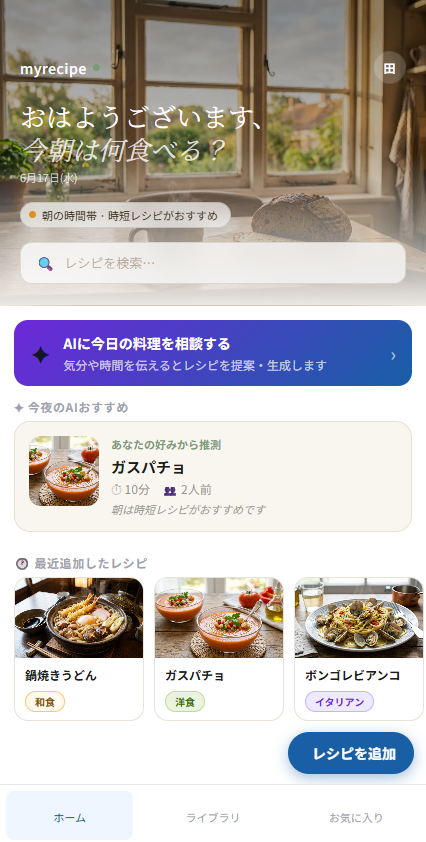
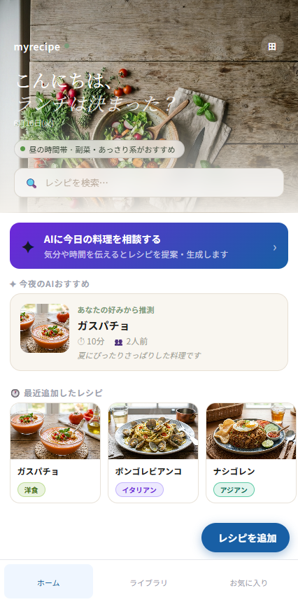
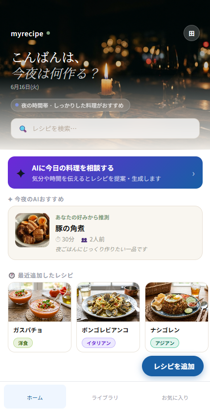

# MyRecipeBook

**自分だけのオリジナルレシピをデジタルで管理する、シンプルで賢いWebアプリ。**

料理写真・材料・手順をまとめて保存し、人数に合わせた分量自動計算・AIアシスタントによる料理サポートを提供します。v4.0.1 では UI を全面刷新し、RAG（検索拡張生成）を本格実装しました。

<br>

---

## v4.0.1 アップデート内容

### 1. UI 全面刷新 — Cream & Sage デザインシステム

v4.0.0 までのハニーゴールド（#F5A623）ヘッダーから脱却し、上品で落ち着きのある新しいデザインシステムへ移行しました。

**カラーパレット**

| 役割 | 色 | 用途 |
|---|---|---|
| ベース | `#f4f1ec`（オフホワイト） | 全体の背景色 |
| アクセント | `#7a9a78`（セージグリーン） | ロゴ・バッジ・お気に入り |
| インク | `#1c1c1a`（ほぼ黒） | 本文・見出し |
| カード | `#ffffff` | カード背景 |
| ボーダー | `#ddd6c8` | 区切り線 |

**タイポグラフィ**

見出しに Cormorant Garamond（セリフ体）のイタリック体を採用し、挨拶文に柔らかい曲線の質感を加えました。本文は Noto Sans JP の weight 300 を基調とし、情報の軽さと読みやすさを両立しています。

**ヘッダーとフッターの明確な区切り**

以前は本文とヘッダーの背景色が近く境界が曖昧でした。v4.0.1 では単純な線引きではなく、コードレベルのこだわりで視覚的な区切りを実現しています。

ヘッダー下部のセパレーターは `1px` の単色線ではなく、端に向かって透明にフェードするグラデーション線を絶対配置で実装しています。境界線が「主張しすぎず、でも確かに存在する」という微妙な質感が生まれます。

```jsx
{/* ヘッダー下部グラデーションセパレーター */}
<div style={{
  position: 'absolute', bottom: 0, left: 0, right: 0, height: 1,
  background: 'linear-gradient(90deg, transparent, rgba(180,165,145,.5) 20%, rgba(180,165,145,.5) 80%, transparent)',
  zIndex: 3
}} />
```

フッターはベースカラーのクリーム色（`#f4f1ec`）に対して純白（`#ffffff`）を指定し、わずかな明度差でナビゲーションエリアを視覚的に引き締めています。上向きの `box-shadow` と組み合わせることでフッターが「浮き上がる」感覚を演出しています。

```jsx
/* フッター — 純白 + 上向きシャドウで本文と区別 */
{
  background: '#ffffff',
  borderTop: '1px solid #ddd6c8',
  boxShadow: '0 -4px 12px rgba(0,0,0,.06)',
}
```

<br>

### 2. 時刻連動ヘッダー背景

ホーム画面のヘッダー背景が、アプリを開いた時間帯に応じて自動で切り替わります。

| 時間帯 | 画像ファイル | イメージ |
|---|---|---|
| 朝（5時〜11時） | `morning.jpg` | キッチンの窓から差し込む朝の光、湯気立つコーヒーとパン |
| 昼（11時〜17時） | `noon.jpg` | 木製テーブルに並ぶ新鮮な野菜の俯瞰、窓からの自然光 |
| 夜（17時〜翌5時） | `night.jpg` | キャンドルが灯るダイニングテーブル、奥にボケたライト |

画像は `frontend/public/images/header/` に格納するだけで有効になります。コードの変更は不要です。

| 朝 | 昼 | 夜 |
|:---:|:---:|:---:|
|  |  |  |

時間帯に応じてテキストカラーとオーバーレイ透明度も自動調整されます。昼の明るい背景では白テキスト＋暗めのオーバーレイ、夜の暗い背景では白テキスト＋薄めのオーバーレイで、いずれの時間帯でもテキストが読みやすい状態を維持します。

<br>

### 3. 時刻・季節連動型パーソナライズ提案システム

背景画像の切り替えはあくまで見た目の変化です。v4.0.1 の本質的な工夫は、その裏側で動いている **レシピの動的スコアリングロジック** にあります。

アプリを開いた瞬間に「現在時刻」と「現在の月（季節）」を算出し、ライブラリ内のレシピ全件をスコアリングして最もスコアの高いものを「AIおすすめ」として表示します。外部 API に依存せず、フロントエンド単体でユーザーの潜在的なニーズを予測する仕組みです。

**スコアリング仕様（`scoreRecipe` 関数）**

| 条件 | 対象 | 加点 |
|---|---|---|
| 朝（5〜11時） | 調理時間 20分以内のレシピ | +3点 |
| 昼（11〜17時） | 「副菜」カテゴリ | +2点 |
| 夜（17〜翌5時） | 調理時間 20分以上のレシピ | +3点 |
| 夜（17〜翌5時） | 「和食」カテゴリ | +1点 |
| 夏（6・7・8月） | 「アジアン」「洋食」カテゴリ | +2点 |
| 冬（11・12・1・2月） | 「和食」「中華」カテゴリ | +2点 |
| 常時 | お気に入り登録済みレシピ | +1点 |

たとえば冬の夜 20 時に起動した場合、「鍋料理（和食・60分）」は時刻で +3点・カテゴリで +1点・季節で +2点の計 **+6点** が加算されます。一方、同じ状況で「サラダ（副菜・5分）」はすべての条件を外れるため 0点となり、自然に後方へ押し下げられます。

```js
// HomePage.jsx — scoreRecipe 関数の実装
function scoreRecipe(recipe) {
  const h = new Date().getHours()
  const m = new Date().getMonth() + 1
  let score = 0
  if (h < 11 && recipe.cook_time <= 20)               score += 3  // 朝：時短
  if (h >= 11 && h < 17 && recipe.category === '副菜') score += 2  // 昼：副菜
  if (h >= 17 && recipe.cook_time > 20)               score += 3  // 夜：じっくり
  if (h >= 17 && recipe.category === '和食')           score += 1  // 夜：和食
  if ([6,7,8].includes(m)  && ['アジアン','洋食'].includes(recipe.category)) score += 2
  if ([11,12,1,2].includes(m) && ['和食','中華'].includes(recipe.category))  score += 2
  if (recipe.is_favorite) score += 1                              // お気に入り
  return score
}
```

このスコアリングはライブラリが育つほど精度が上がる設計です。登録レシピが 1 件のときは自動的にそのレシピが表示されますが、10 件を超えると時刻・季節・好みの三軸で本来の推薦効果が発揮されます。

<br>

### 4. RAG（検索拡張生成）の本格実装

v4.0.0 まで ChromaDB はレシピ保存時にベクターインデックスを作成するだけで、実際の検索には使用していませんでした。v4.1 では RAG パイプラインを本格実装し、ユーザーのライブラリ全体を横断する AI 回答を実現しました。

**従来の AI アシスタント（v4.0 まで）**

```
ユーザーの質問 → GPT の学習済み知識のみで回答
```

**RAG アシスタント（v4.1）**

```
ユーザーの質問
  ↓
ChromaDB でライブラリ全体を意味検索（コサイン類似度）
  ↓ 関連レシピ上位 4 件を取得
プロンプトに検索結果を注入
  ↓
GPT が「ユーザーのレシピ」を参照した上で回答
  ↓
レスポンスに参照レシピ一覧（references）を含めて返却
```

**インデックスの改善**

ベクター化するテキストをラベル付き構造化フォーマットに変更しました。

```
レシピ名: 豚の角煮
カテゴリ: 和食
調理時間: 90分
人数: 2人前
材料: 豚バラ 500g、醤油 大さじ3、みりん 大さじ2...
手順: 1. 豚バラを一口大に切る。2. フライパンで...
```

ラベルなしのフラットテキストと比較して、「みりんの代用は？」のような材料名ベースの質問でも関連レシピがヒットしやすくなっています。

**スコアフィルタリング**

ChromaDB が返すコサイン距離が閾値（`1.2`）を超えるものは除外します。関連性の薄い検索結果をプロンプトに含めることで発生するハルシネーションを防ぎます。

**新規 API エンドポイント**

```
POST /api/ai/search-assist
```

```json
// レスポンス例
{
  "answer": "豚の角煮レシピの手順3では醤油大さじ3を使用しています。みりんの代用には砂糖小さじ1＋酒大さじ1が適しています。",
  "is_mock": false,
  "references": [
    { "recipe_id": 3, "title": "豚の角煮", "category": "和食", "score": 0.182 },
    { "recipe_id": 7, "title": "肉じゃが",  "category": "和食", "score": 0.341 }
  ]
}
```

`references` フィールドにより、フロントエンドが「このレシピを参照して回答しました」という根拠表示を実装できます。

<br>

---

## 変更ファイル一覧（v4.0.0 → v4.0.1）

### バックエンド

| ファイル | 変更内容 |
|---|---|
| `repositories/vector_repository.py` | `build_recipe_document()` でインデックス用テキストを構造化。`search_similar_recipes()` を新規追加（コサイン類似度検索・スコアフィルタリング） |
| `services/ai_service.py` | `search_assist()` を新規追加。Retrieval → Augmented Generation のパイプラインを実装 |
| `services/ai/openai_client.py` | `search_assist()` を新規追加。コンテキスト注入プロンプト（`_RAG_ASSIST_PROMPT`）を実装 |
| `routers/ai.py` | `POST /api/ai/search-assist` エンドポイントを追加。`SearchAssistResponse` に `references` フィールドを含む |

### フロントエンド

| ファイル | 変更内容 |
|---|---|
| `pages/HomePage.jsx` | Cream & Sage テーマに全面刷新。時刻判定（`getTimeConfig()`）と時刻別ヘッダー背景画像の切り替えを実装 |
| `global.css` | カラー変数・タイポグラフィ・カードスタイルを新デザインシステムに更新 |

### 静的ファイル

| パス | 内容 |
|---|---|
| `frontend/public/images/header/morning.jpg` | 朝のキッチン背景画像 |
| `frontend/public/images/header/noon.jpg` | 昼の食材俯瞰背景画像 |
| `frontend/public/images/header/night.jpg` | 夜のダイニング背景画像 |

<br>

---

## 画像の差し替え方法

時間帯別背景画像はコードを一切変更せずに差し替えできます。

```
frontend/public/images/header/
├── morning.jpg   （推奨サイズ: 800×400px、WebP 可）
├── noon.jpg
└── night.jpg
```

ファイルを同名で上書き保存するだけで次回ページ読み込み時から反映されます。

<br>

---

## v4.0.1 時点での既知の課題

**RAG の検索精度はレシピ数に依存する**

バックエンドの `search_similar_recipes()` は `n_results=4` を指定しているため、登録レシピが 4 件未満の場合はベクトル空間の密度不足により類似検索がヒットしない、またはスコアフィルタリング（閾値 `1.2`）で除外されるケースがあります。まずは 4 件以上（推奨 10 件以上）のレシピ登録を行った状態での動作確認を推奨します。

なお、登録レシピが 0 件の場合でも LLM へのコンテキスト注入を安全にスキップし、「関連するレシピが見つかりませんでした」という注意メッセージを返すフォールバックロジックが実装済みです。レシピ未登録状態でも AI がハルシネーション（事実ではない情報の生成）を起こすリスクは排除されています。

**モック時の RAG 回答は検索のみ実施**

`LLM_PROVIDER=mock`（APIキー未設定）の場合、ChromaDB による検索自体は実行されますが、回答文はテンプレートになります。プロンプト注入と LLM 回答の品質確認には `OPENAI_API_KEY` の設定が必要です。

<br>

---

## ローカル起動手順

```powershell
# ターミナル 1（バックエンド）
cd backend
venv\Scripts\activate
uvicorn main:app --reload

# ターミナル 2（フロントエンド）
cd frontend
npm run dev
```

`http://localhost:5173` をブラウザで開いてください。

<br>

---

## 注記

ホーム画面以外のページ（ライブラリ・レシピ詳細・フォームなど）のスクリーンショットおよび説明は、前バージョン（v4.0.0）の README を参照してください。

<br>

---

## 開発者について

フルスタック開発・AI連携・UXデザインの実践的な学習を目的に制作している個人開発プロジェクトです。

技術的な質問・フィードバック・コラボレーションのご提案は Issue または Discussions からどうぞ。

<br>

---

## ライセンス

MIT License — 詳細は [LICENSE](LICENSE) をご覧ください。
