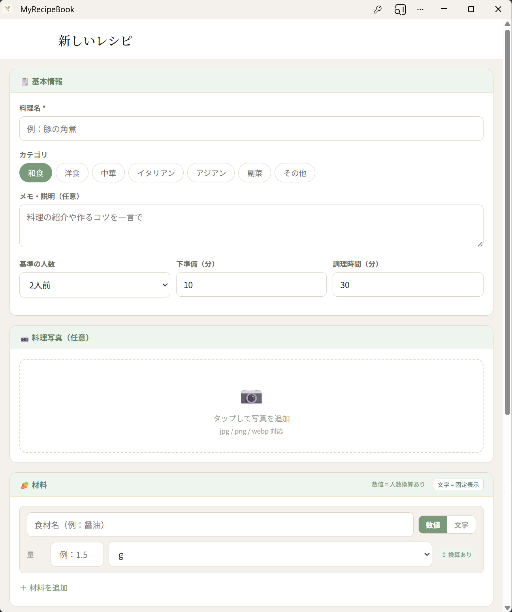
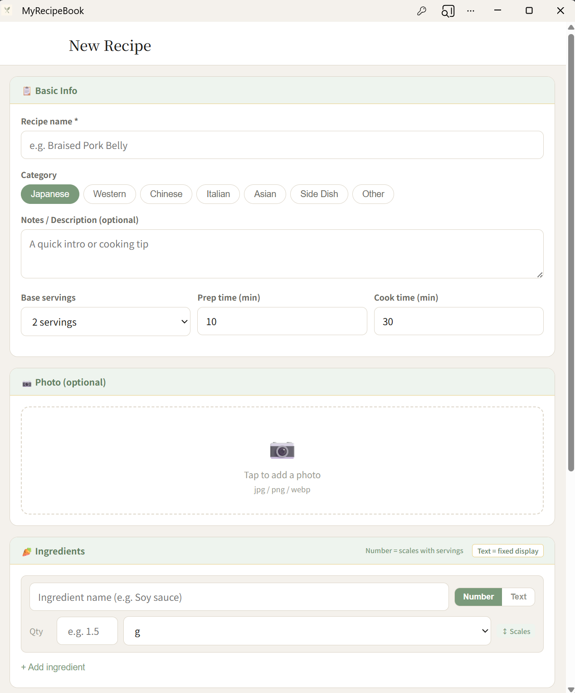
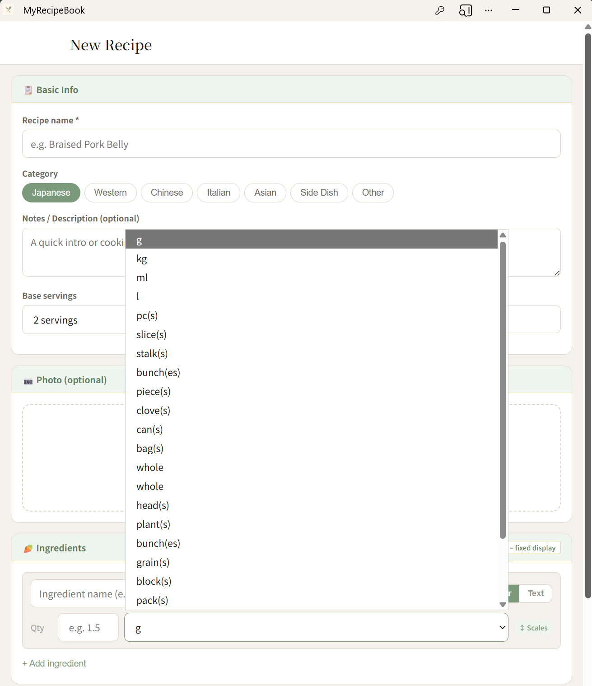
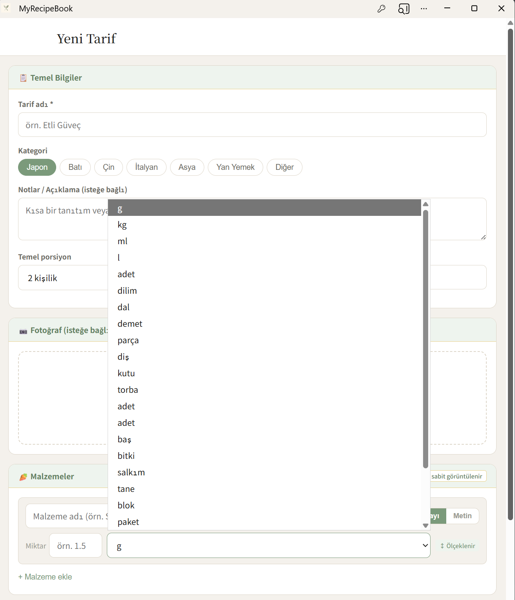

# MyRecipeBook

**自分だけのオリジナルレシピをデジタルで管理する、シンプルで賢いWebアプリ。**

料理写真・材料・手順をまとめて保存し、人数に合わせた分量自動計算・AIアシスタントによる料理サポートを提供します。v4.7では、v4.6で基盤を構築した多言語対応をさらに深化させ、レシピ作成・編集フォームの全ラベル対応、料理カテゴリ・分量単位の表示切替、および全ページにわたる表示の一貫性を完成させました。

<br>

## スクリーンショット

| レシピ作成フォーム（日本語） | レシピ作成フォーム（英語） |
|:---:|:---:|
|  |  |

| カテゴリ・単位（英語表示） | カテゴリ・単位（トルコ語表示） |
|:---:|:---:|
|  |  |

<br>

---

## v4.7 アップデート内容

v4.6でアプリ全体のUI文字列を多言語化しましたが、以下の3点が未対応のままでした。

- `RecipeFormPage.jsx`（レシピ追加・編集フォーム）のラベル・バリデーションメッセージが日本語ハードコードのまま
- 料理カテゴリ（「和食」「中華」など）がどの言語に切り替えてもDB保存値の日本語表記で表示される
- 分量の単位（「枚」「束」など）が同様に日本語表記のまま表示される

v4.7ではこれら3点をすべて解消し、レシピ作成から閲覧・買い物リストまでの全画面で表示の一貫性を確保しました。

<br>

### 1. `RecipeFormPage.jsx` の多言語対応

**症状:** レシピを新規作成・編集するフォーム画面のラベル・プレースホルダー・バリデーションメッセージ・ボタン文字列がすべて日本語ハードコードのままで、言語を切り替えても一切変化しなかった。

**修正内容:** `useTranslation()` を導入し、`recipeForm.*` 名前空間に40キーの翻訳定義を追加。フォーム内のすべての文字列を `t()` に置き換えた。

対応した主な箇所は以下のとおり。

| 箇所 | 変更前（日本語固定） | 変更後 |
|---|---|---|
| ページタイトル | 「新しいレシピ」「レシピを編集」 | `t('recipeForm.pageNew')` / `t('recipeForm.pageEdit')` |
| セクション見出し | 「📋 基本情報」「🥕 材料」「📝 作り方の手順」など | `t('recipeForm.sectionBasic')` など |
| フォームラベル | 「料理名 *」「カテゴリ」「基準の人数」など | `t('recipeForm.titleLabel')` など |
| 材料モード切替 | 「数値」「文字」 | `t('recipeForm.ingModeNum')` / `t('recipeForm.ingModeText')` |
| 換算バッジ | 「↕ 換算あり」「固定表示」 | `t('recipeForm.ingUnitScaled')` / `t('recipeForm.ingFixed')` |
| テキストモード注意書き | 「…そのまま固定表示されます…」 | `t('recipeForm.ingTextNote')` （`<strong>` 箇所も言語別に定義） |
| 工程ラベル | 「工程 1」「工程 1 の説明を入力」 | `t('recipeForm.stepLabel', { number: 1 })` |
| ボタン | 「保存中…」「変更を保存」「レシピを登録」「キャンセル」 | `t('recipeForm.saving')` など |
| エラーメッセージ | 「料理名を入力してください」「保存に失敗しました」など | `t('recipeForm.errorTitle')` など |

<br>

### 2. 料理カテゴリの多言語表示対応

**症状:** 「和食」「洋食」「中華」などのカテゴリ名が、英語・トルコ語に切り替えても日本語表記のまま表示されていた。レシピ作成フォームのカテゴリ選択ボタン、レシピ詳細・公開レシピページのカテゴリバッジ、AIレシピ生成プレビューのカテゴリバッジで同様の問題が発生していた。

**設計判断 — DBの保存値は変更しない:**

カテゴリ名はDB上では `"和食"` `"中華"` という日本語文字列のまま保存されている。これを `"japanese"` `"chinese"` などの言語中立なキーに変更する方針もあったが、以下の理由から保存値は変えず、表示時だけ翻訳マップを通す設計を採用した。

- 既存レシピデータへのマイグレーションが不要になる
- バックエンドのバリデーションロジックを変更せずに済む
- カテゴリは選択肢が固定の閉じたリストであり、DBキーが日本語であっても翻訳マップが破綻しない
- ポートフォリオ規模のプロジェクトに対してスキーマ変更はオーバーエンジニアリングである

**実装方法:**

```javascript
// 各コンポーネントで1行追加するだけ
const tCat = (key) => t(`categories.${key}`, { defaultValue: key })

// 使用例（DBキー"和食"のまま保存・表示は言語別に変換）
<span className={`cat-badge cat-${recipe.category}`}>
  {tCat(recipe.category)}
</span>
```

`defaultValue: key` を指定しているため、翻訳マップに存在しないキーが来た場合でも元の日本語文字列がフォールバックとして表示され、エラーにならない。

**対応ファイル:** `RecipeFormPage.jsx` / `RecipeDetailPage.jsx` / `PublicRecipePage.jsx` / `DiscoverPage.jsx`

<br>

### 3. 分量単位の多言語表示対応

**症状:** 「枚」「束」「片」などの単位表記が、英語・トルコ語に切り替えても日本語表記のまま表示されていた。レシピ作成フォームの単位セレクト、買い物リスト（入力モード・リストモード）、保存済み買い物リスト、ライブラリの買い物リストプレビューで同様の問題が発生していた。

**設計判断 — DBの保存値は変更しない:**

カテゴリと同じ理由により、DB上の保存値（`"枚"` `"束"` など）は変更せず、表示時のみ翻訳マップを通す設計を採用した。単位はカテゴリ以上に既存データとの整合が重要であり（分量計算時に保存値を直接参照するロジックが存在するため）、保存値を変更するリスクは特に高い。

**実装方法:**

```javascript
const tUnit = (key) => t(`units.${key}`, { defaultValue: key })

// 使用例（DB値"枚"のまま保存・表示は "slice(s)" / "dilim" 等に変換）
<option key={u} value={u}>{tUnit(u)}</option>
```

**対応ファイル:** `RecipeFormPage.jsx` / `ShoppingListPage.jsx` / `SavedShoppingListPage.jsx` / `LibraryPage.jsx`

<br>

### 4. レシピ本文（工程・材料名）の自動翻訳は対応範囲外とした理由

レシピの工程・説明文・材料名はユーザーが任意の言語で自由記述するコンテンツであり、UIラベルとは性質が根本的に異なる。本バージョンでの実装を断念した理由は以下のとおり。

**翻訳品質の問題:** 料理の工程文には「炒める」「ひとつまみ」「面取り」のような調理用語が多く、汎用翻訳APIでは誤訳・不自然な表現が生じやすい。誤った調理手順が表示されることはUXの毀損に直結する。

**コスト・アーキテクチャの問題:** 表示のたびに翻訳APIを呼ぶ構成では通信コストとレスポンス遅延が発生する。DBに多言語カラムを持つ構成ではスキーマ変更と既存データの一括マイグレーションが必要になる。どちらもポートフォリオ規模のアプリに対してオーバーエンジニアリングである。

**サービス設計上の一般慣行:** CookpadやRecipetin Japanなど実際のレシピサービスも、ユーザー投稿コンテンツは投稿言語のまま表示し、UIのみを多言語化する設計を採用している。

以上の理由から、**レシピ本文は入力言語のまま表示し、UIのみ多言語化する**設計としている。将来対応する場合は、レシピ共有（フォーク）時に翻訳APIを1回だけ適用してDBにキャッシュする設計が現実的と考える。

<br>

---

## 技術スタック

- **フロントエンド**: React 18.3 / React Router v6 / Vite 5.4 / Axios 1.7 / vite-plugin-pwa / react-i18next 14 / i18next-browser-languagedetector
- **バックエンド**: FastAPI 0.115 / SQLAlchemy 2.0 / Pydantic v2 / SQLite
- **認証**: passlib（bcrypt） / python-jose（JWT）
- **AI・データ**: ChromaDB / Google Gemini API（gemini-2.5-flash）/ Imagen 3（コメントアウト済み）

<br>

---

## 変更ファイル一覧（v4.6 → v4.7）

### 翻訳JSONの更新

| ファイル | 変更内容 |
|---|---|
| `src/i18n/locales/ja.json` | `categories.*`（7キー）・`units.*`（24キー）・`recipeForm.*`（40キー）を追加 |
| `src/i18n/locales/en.json` | 同上（英語訳） |
| `src/i18n/locales/tr.json` | 同上（トルコ語訳） |

### フロントエンド（既存ファイルの変更）

| ファイル | 変更内容 |
|---|---|
| `pages/RecipeFormPage.jsx` | `useTranslation()` を導入。全ラベル・バリデーション・ボタンを `t()` に置き換え。カテゴリボタン・単位セレクトを `tCat()` / `tUnit()` 経由に変更 |
| `pages/RecipeDetailPage.jsx` | カテゴリバッジの表示を `tCat()` 経由に変更 |
| `pages/PublicRecipePage.jsx` | 同上 |
| `pages/DiscoverPage.jsx` | AIレシピ生成プレビューのカテゴリバッジを `tCat()` 経由に変更 |
| `pages/ShoppingListPage.jsx` | 必要量・手持ち量・購入量の単位表示を `tUnit()` 経由に変更 |
| `pages/SavedShoppingListPage.jsx` | 購入リストの単位表示を `tUnit()` 経由に変更 |
| `pages/LibraryPage.jsx` | ショッピングリストプレビューの単位タグを `tUnit()` 経由に変更 |

<br>

---

## 既知の課題と対応状況

**メール確認（verification）は未実装**

現在の新規登録は「登録した瞬間にログイン状態になる」簡易フローです。メール確認フローを実装するにはSendGridやAWS SESなどのメール送信サービスとの連携が必要になります。外部サービスの利用コストと、ポートフォリオ用途のアプリであるという位置づけのトレードオフを考慮した上で、現時点では実装を見送っています。

**レシピ画像の自動生成は保留（ポートフォリオ環境）**

Imagen 3 による画像自動生成は `gemini_client.py` にコメントアウトで実装済みです。画像生成APIの利用はリクエストごとにコストが発生するため、ポートフォリオ環境での常時有効化は行っていません。本番運用時はコメントアウトを解除し、画像保存先（S3等）を設定することで有効化できます。

**`RecipeListPage.jsx` の多言語対応は保留**

`LibraryPage.jsx` と機能が重複しているページであり、実際のルーティングで使用されているかが不明なため、引き続き対応を保留しています。

**ユーザー投稿コンテンツ（レシピ本文）の言語横断翻訳は対応範囲外**

レシピタイトル・材料名・手順などのUGCは、入力された言語のまま保存・表示される仕様です。断念の詳細な理由は「v4.7 アップデート内容 4.」を参照してください。

<br>

---

## ローカル起動手順

v4.6からの変更点はありません。

```powershell
# ターミナル 1（バックエンド）
cd backend
venv/Scripts/activate
uvicorn main:app --reload

# ターミナル 2（フロントエンド）
cd frontend
npm run dev
```

ヘッダー右上の🌐ボタンから言語を切り替えられます。選択結果はブラウザに保存され、リロード後も保持されます。

<br>

---

## 次期アップデートについて

`RecipeListPage.jsx` の扱いの整理（削除または `LibraryPage.jsx` への統合）を予定しています。また、v4.0.1でテスト実装したRAGの `references` フィールドを活用した根拠表示の追加、Imagen 3による画像生成の本番有効化、フォーク数の表示・通知設定の実装も引き続き検討しています。

<br>

---

## 開発者について

フルスタック開発・AI連携・認証基盤・UXデザインの実践的な学習を目的に制作している個人開発プロジェクトです。

技術的な質問・フィードバック・コラボレーションのご提案は Issue または Discussions からどうぞ。

<br>

---

## ライセンス

MIT License — 詳細は [LICENSE](LICENSE) をご覧ください。
