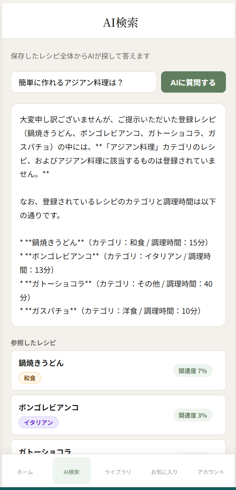
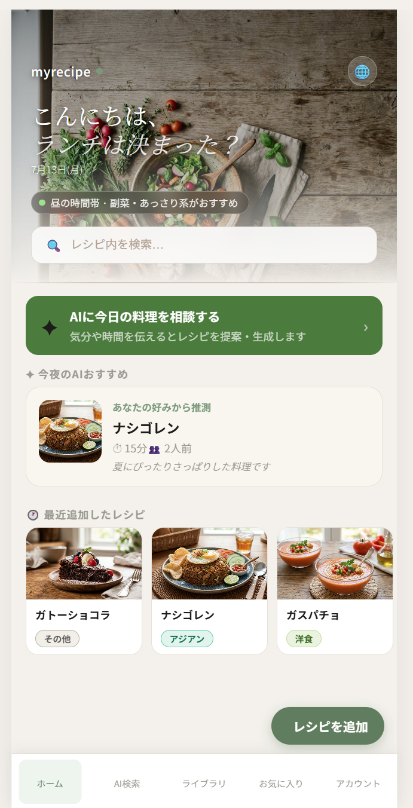
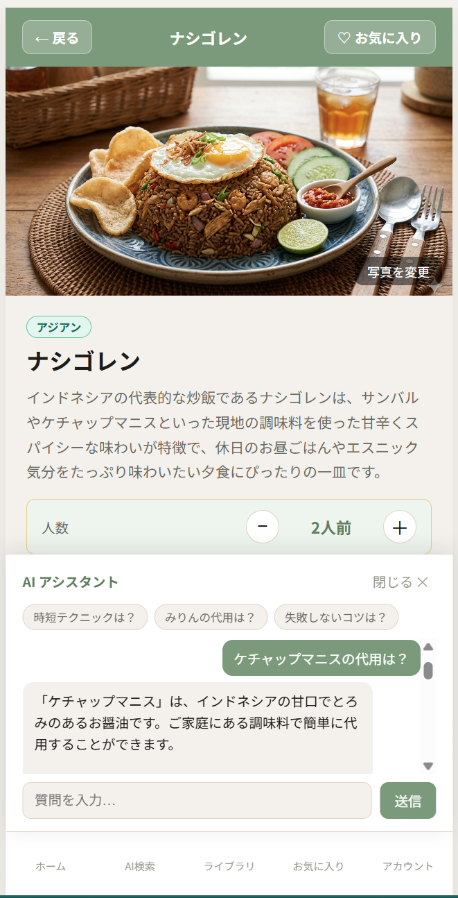
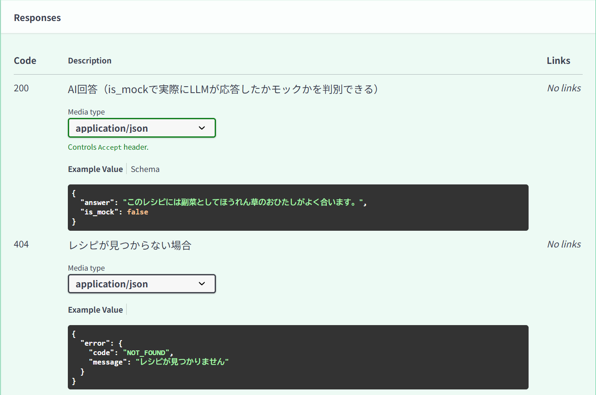

# MyRecipeBook

**自分だけのオリジナルレシピをデジタルで管理する、シンプルで賢いWebアプリ。**


料理写真・材料・手順をまとめて保存し、人数に合わせた分量自動計算・AIアシスタントによる料理サポートを提供するフルスタックWebアプリです。企画、実装・テスト・公開デプロイ・不具合の原因調査・仕上げを実施しv5.2にて一区切りの完了としました。その後、RAG評価手法を学習する中で自作の評価スクリプトを本プロジェクトに適用し、実運用上の問題を発見・修正したv5.3を追加しています。

**[公開デモを見る](https://ai-recipe-book-wheat.vercel.app)**（Render無料枠のためコールドスタートで初回表示に数十秒かかる場合があります）

<br>

## 目次

- [スクリーンショット](#スクリーンショット)
- [このプロジェクトで示せること](#このプロジェクトで示せること)
- [主な機能](#主な機能)
- [技術スタック](#技術スタック)
- [アーキテクチャ](#アーキテクチャ)
- [RAG精度検証](#rag精度検証)
- [技術的なハイライト](#技術的なハイライト)
- [ローカル起動手順](#ローカル起動手順)
- [開発履歴・詳細ドキュメント](#開発履歴詳細ドキュメント)
- [設計上の意図的なスコープ外事項](#設計上の意図的なスコープ外事項)
- [開発者について](#開発者について)
- [ライセンス](#ライセンス)

<br>

---

## スクリーンショット

| AI検索（RAGによる回答＋参照レシピ） | BottomNav（5タブ構成） |
|---|---|
|  |  |

| AIチャットのフォールバック通知（toast） | Swagger UI（統一エラー形式） |
|---|---|
|  |  |

<br>

---

## このプロジェクトで得た経験

- **RAGを用いたAI機能をゼロから設計・実装**：ChromaDBによるベクター検索とGoogle Gemini API（`gemini-3.5-flash`）を組み合わせ、登録レシピ横断のAI検索（`search-assist`）とレシピ個別のAI質問（`ai-assist`）を実装。関連度の足切り閾値・プロンプト設計の調整を試みた。
- **テスト・CI・マイグレーションを含む品質基盤の整備**：pytest（29件）・ruffによるlint・GitHub Actions CIを導入し、手書きスキーマ管理からAlembicへ全面移行。
- **本番相当環境への公開デプロイと複数端末での実機検証**：Render（バックエンド）+ Vercel（フロントエンド）に公開し、CORS設定・Pythonバージョン固定・エフェメラルディスクの制約、日本語Windows環境特有のエンコーディング問題までを複数端末での新規セットアップ検証を通じて解決し出来た。
- **最終的な調整についてはフェーズ単位に切り分けて実施**：v4.7からv5.3まで7段階のフェーズに切り分けて、動作確認とリリースノート作成までを一貫して実施した。

<br>

---

## 主な機能

- レシピの登録・編集・削除（写真・材料・手順・カテゴリ・公開設定）
- 人数に合わせた材料分量の自動計算
- 買い物リストの自動生成（必要量・手持ち量の管理）
- レシピ個別へのAI質問（`ai-assist`）— 開いているレシピの材料をもとにGeminiが代用品・追加食材などを提案
- 登録レシピ横断のAI検索（`search-assist`）— RAG（ChromaDBによるベクター検索）で関連レシピを検索し、根拠付きで回答を生成
- 日本語／英語／トルコ語のUI多言語対応
- JWT認証によるユーザー管理、レシピの公開・非公開設定

<br>

---

## 技術スタック

- **フロントエンド**: React 18.3 / React Router v6 / Vite 5.4 / Axios 1.7 / vite-plugin-pwa / react-i18next 14 / i18next-browser-languagedetector / react-markdown
- **バックエンド**: FastAPI 0.115 / SQLAlchemy 2.0 / Pydantic v2 / SQLite / Alembic
- **認証**: passlib（bcrypt） / python-jose（JWT）
- **AI・データ**: ChromaDB（埋め込み: Gemini `gemini-embedding-001`）/ Google Gemini API（`gemini-3.5-flash`）/ Imagen 3（コメントアウト済み）
- **テスト・品質管理**: pytest / httpx / ruff / GitHub Actions（CI）
- **デプロイ**: Render（バックエンド）/ Vercel（フロントエンド）

<br>

---

## アーキテクチャ

```
AI-Recipe-Book/
├── backend/
│   ├── main.py                  # FastAPIエントリポイント・共通エラーハンドラ
│   ├── models.py                # SQLAlchemyモデル
│   ├── database.py              # DB接続・セッション管理
│   ├── config.py                # 環境変数・設定（Pydantic Settings）
│   ├── auth.py                  # JWT認証ロジック
│   ├── errors.py                # 統一エラーレスポンスのヘルパー
│   ├── routers/                 # APIエンドポイント（recipes / ai / auth / shopping_lists 等）
│   ├── services/
│   │   ├── ai_service.py        # AIオーケストレーション（RAG検索・回答生成）
│   │   └── ai/                  # Gemini / OpenAI クライアント実装
│   ├── repositories/
│   │   └── vector_repository.py # ChromaDBとのRAG検索ロジック
│   ├── migrations/               # Alembicマイグレーション
│   └── tests/                    # pytest（認証・レシピCRUD・AI）
│
├── frontend/
│   └── src/
│       ├── pages/                 # 画面単位のコンポーネント
│       ├── components/            # 共通UIコンポーネント（AIPanel, MarkdownText 等）
│       ├── hooks/                 # データ取得・状態管理ロジック
│       ├── api/                   # バックエンドAPIクライアント（axios）
│       ├── context/                # React Context（Toast等）
│       └── i18n/                   # 多言語対応（ja/en/tr）
│
└── docs/                          # 設計ドキュメント・過去バージョンのREADMEスナップショット
```

システム構成図・RAGの実例（プロンプト/出力例）は[`docs/Version_5.0/architecture.md`](docs/Version_5.0/architecture.md)・[`docs/Version_5.0/demo_examples.md`](docs/Version_5.0/demo_examples.md)を参照してください。

<br>

---

## RAG精度検証

`search-assist`（RAG横断検索）について、自作の評価用クエリ8問（単純検索・食材指定・表記ゆれ・口語表現・複数条件・存在しない情報・曖昧な質問の各カテゴリ）を用いて、ChromaDBのコサイン距離を定量的に計測・比較した。

### 発見した問題

開発中の動作確認で、実在するレシピ名を含む質問（例：「ナシゴレンのレシピを教えて」）でも検索結果が0件になる事象を発見。`vector_repository.py`の`get_or_create_collection()`で埋め込み関数（`embedding_function`）を明示的に指定していなかったため、ChromaDBのデフォルト埋め込みモデル（英語中心・日本語の意味理解に弱い）が使われていたことが根本原因と判明した。

### 計測結果（抜粋）

質問「ナシゴレンのレシピを教えて」に対する、登録レシピとのコサイン距離（小さいほど類似度が高い）。

| 順位 | 変更前（ChromaDBデフォルト） | 変更後（Gemini `gemini-embedding-001`） |
|---|---|---|
| 1位 | ガトーショコラ 0.9222 | **ナシゴレン 0.1930** |
| 2位 | ガスパチョ 0.9493 | 鍋焼きうどん 0.3662 |
| 4位 | ナシゴレン 0.9851 | ボンゴレビアンコ 0.3978 |

質問文にレシピ名がそのまま含まれる基準ケースで、正解レシピの順位が4位→1位に改善。全8問・全40件の距離が変更前は`0.89〜1.09`という極めて狭い範囲に密集していたのに対し、変更後は`0.19〜0.42`という意味的な区別が可能な範囲に変化したことを確認した。これに伴い、変更前は実質的にどの質問でも0件になっていた`score_threshold=0.85`を`0.35`に再調整した。

計測に使用した生データは[`docs/Version_5.3/before_after_comparison.md`](docs/Version_5.3/before_after_comparison.md)を、調査プロセスの詳細は[`docs/Version_5.3/investigation_log.md`](docs/Version_5.3/investigation_log.md)を、検証に使用したスクリプトは[`docs/Version_5.3/scripts/`](docs/Version_5.3/scripts/)を参照。

### 副次的に発見・対応した問題

- **レシピの重複登録**：過去のデータ復旧作業により、登録済みレシピ5件が重複していたことが判明。整理して解消。
- **テストのベクトルDB隔離漏れ**：`tests/conftest.py`は登録処理（`upsert_recipe`）はモック化していたが、検索処理（`search_similar_recipes`）はモック対象に含まれておらず、pytest実行時に本番のChromaDBデータを参照してしまっていた。検索処理もモック対象に追加し、テストの独立性を確保した。

### 既知の課題（未検証の範囲）

- `vector_repository.py`の`if collection.count() == 0: return []`という分岐（ChromaDBが実際に空の場合の挙動）は、実装上は例外を投げず空リストを返す設計になっているが、pytestではこの関数自体をモックして検証しているため、本物のChromaDBが実際に0件の状態でこの分岐を通ることの実行時検証は未実施。優先度が低いため一旦許容している。

<br>

---

## ハイライト

**本物のAI応答に切り替えて初めて見える粗**
mockフォールバックでの検証だけでは気づけなかった問題（RAGの関連度足切りが緩すぎる、AI応答のMarkdown記法が生表示される、内部管理用のレシピ番号が回答に混入する）は、実際にGemini APIで本物の応答を確認するようになって初めて発覚した。「動いているように見える」状態と「意図通りに動いている」状態は別であるという教訓から、最終フェーズで一つずつ対応した。

**一貫した型を保持するアップデート**

- 既存コードを壊さない最小差分を優先する（例：エラーレスポンス統一時、各routerの`raise HTTPException`は一切変更せず`main.py`の共通ハンドラのみで対応）
- スキーマ変更やオーバーエンジニアリングを避け、実サービス（Cookpad等）の設計慣行も参考にしつつポートフォリオ規模に見合った実装を選ぶ（例：UGCの多言語翻訳は対象外とし、UIラベルのみ多言語化）
- `ai-assist`（レシピ単体）と`search-assist`（レシピ横断）は同じAIオーケストレーションを使いつつ、エンドポイントの配置自体で責務の違いを表現

**環境差異の対応**
複数端末（日本語Windows環境含む）での新規セットアップ検証を通じて、`pip install`時のロケール依存エンコーディングエラーや依存パッケージのバージョン競合などの問題を複数発見・修正出来た。

<br>

---

## ローカル起動手順

```powershell
# ターミナル 1（バックエンド）
cd backend
venv\Scripts\Activate.ps1
pip install -r requirements.txt
mkdir uploads   # 初回のみ。.gitignore対象のため clone 直後は存在しない
alembic upgrade head
uvicorn main:app --reload

# ターミナル 2（フロントエンド）
cd frontend
npm install
npm run dev
```

**テストの実行:**

```powershell
cd backend
pip install -r requirements-dev.txt
pytest          # 自動テストを実行
ruff check .    # lintチェック
```

ヘッダー右上の🌐ボタンから言語を切り替えられます。選択結果はブラウザに保存され、リロード後も保持されます。

公開デモ環境の構築手順（Render / Vercel）は[`docs/Version_5.0/deployment.md`](docs/Version_5.0/deployment.md)を参照してください。

<br>

---

## 開発履歴・詳細ドキュメント

| バージョン | 概要 |
|---|---|
| **v5.3**（最終リリース） | v5.2完成後、RAG評価手法（Precision@k/Recall@k/RAGAS）を学習する中で本プロジェクトのRAG機能を実測。埋め込みモデル未指定によりChromaDBデフォルト（日本語に弱い）が使われていた問題を発見し、Gemini `gemini-embedding-001`に変更。関連度閾値を`0.85`→`0.35`に再調整。副次的にレシピ重複登録・テストのベクトルDB隔離漏れも発見・解消 |
| [v5.2](docs/Version_5.2/README.md) | ドキュメント重複解消、RAG関連度閾値の調整（`1.2`→`0.85`）、AI応答のMarkdownレンダリング対応（`react-markdown`）、プロンプト設計改善（内部レシピ番号の混入防止）、README全体を採用担当者目線で再編 |
| [v5.1](docs/Version_5.1/README.md) | Gemini API認証エラーの原因調査・修正（モデル廃止が根本原因）、バックエンドエラーレスポンス統一、OpenAPIドキュメント整備、RAG横断検索（`search-assist`）のフロントUI本実装 |
| [v5.0](docs/Version_5.0/README.md) | 公開デモ環境（Render + Vercel）構築、レシピ個別AI質問（`ai-assist`）実装、アーキテクチャ図・RAG実例ドキュメント整備 |
| [v4.9](docs/Version_4.9/README.md) | pytestによる自動テスト・GitHub Actions CI・DBスキーマ整合性修正（`naming_convention`導入） |
| v4.8以前 | 手書きマイグレーションからAlembicへの全面移行、多言語対応（日本語/英語/トルコ語）など。[v5.1時点のスナップショット](docs/Version_5.1/README.md)以下に全詳細を記録 |

各バージョンのリンク先は、そのバージョンをリリースした時点のREADME全文（それ以前の全履歴を含む）です。個別ドキュメントは以下から参照できます。

- [`docs/Version_5.0/architecture.md`](docs/Version_5.0/architecture.md) — システム構成図・レイヤー解説
- [`docs/Version_5.0/demo_examples.md`](docs/Version_5.0/demo_examples.md) — RAGの仕組み・実データに基づくプロンプト/出力例
- [`docs/Version_5.0/deployment.md`](docs/Version_5.0/deployment.md) — Render/Vercelデプロイ手順・環境変数一覧
- [`docs/Version_5.3/before_after_comparison.md`](docs/Version_5.3/before_after_comparison.md) — RAG精度検証のBefore/After計測データ
- [`docs/Version_5.3/investigation_log.md`](docs/Version_5.3/investigation_log.md) — 埋め込みモデル未設定問題の調査ログ
- [`docs/PHASE2_SUMMARY.md`](docs/PHASE2_SUMMARY.md) / [`docs/PHASE3_SUMMARY.md`](docs/PHASE3_SUMMARY.md) — 各フェーズの意思決定記録

<br>

---

## 設計上の意図的なスコープ外事項

いずれも実装を検討した上で、ポートフォリオという位置づけとのトレードオフを踏まえて意図的に対象外とした事項です。

- **Renderの無料枠によるデータの一時性**：エフェメラルディスクのため再起動でデータがリセットされうる。恒久対応（Persistent Disk）はコストに見合わないため、デモ前にデータを再投入する運用としている。
- **メール確認（verification）は未実装**：新規登録は登録直後にログイン状態になる簡易フロー。外部メール送信サービス連携のコストとポートフォリオ用途を踏まえて見送っている。
- **レシピ画像の自動生成は保留**：Imagen 3による生成は`gemini_client.py`にコメントアウトで実装済み。リクエスト課金が発生するため常時有効化はしていない。
- **ユーザー投稿コンテンツ（レシピ本文）の言語横断翻訳は対象外**：UGCは入力言語のまま保存・表示。汎用翻訳APIでの調理用語誤訳リスクとコストに見合わないと判断（UIラベルのみ多言語化）。
- **RAG関連度%表示は近似値**：ChromaDBのコサイン距離を単純な線形変換で%表示しているため、実際の関連性の高さと表示上の数字が直感的に一致しない場合がある。正確なキャリブレーションにはクエリ・レシピ件数を増やした上での再調整が必要になる。

<br>

---

## 開発者について

フルスタック開発・AI連携・認証基盤・UXデザインの実践的な学習を目的に制作した個人開発プロジェクトです。v5.2で機能実装を完了としましたが、その後RAG評価の手法（Precision@k/Recall@k/RAGAS）を学習する中で、自作した評価スクリプトを本プロジェクトに適用したところ、埋め込みモデル未設定という実運用上の問題を発見し、v5.3として修正しました。「完成」を終着点にせず、学んだ評価手法を継続的に既存の実装へフィードバックする姿勢を大切にしています。フォーク数の表示やImagen 3による画像生成の本番有効化など、時間があれば追加で検討したいアイデアも残っています。

技術的な質問・フィードバック・コラボレーションのご提案は Issue または Discussions からどうぞ。

<br>

---

## ライセンス

MIT License — 詳細は [LICENSE](LICENSE) をご覧ください。
