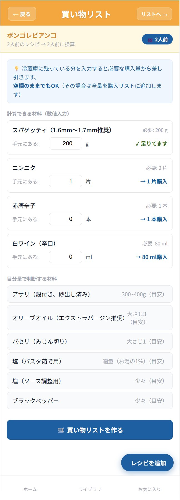
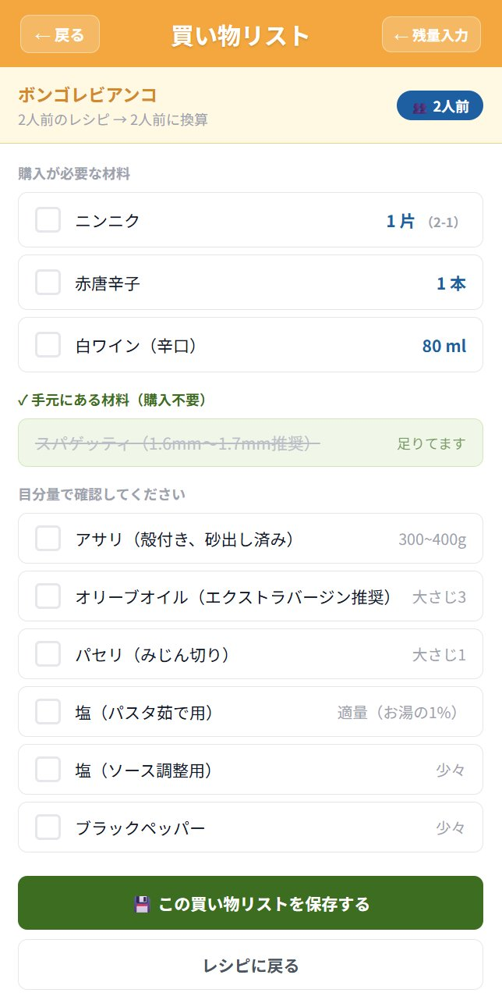
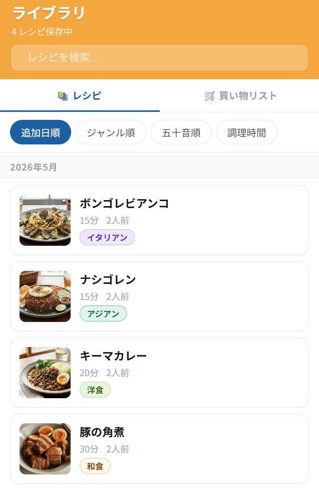

# MyRecipeBook

**自分だけのオリジナルレシピをデジタルで管理する、シンプルで賢いWebアプリ。**

料理写真・材料・手順をまとめて保存し、人数に合わせた分量自動計算・AIアシスタントによる料理サポートを提供します。v3.1 では v3.0 で報告されていた買い物リストの既知の課題2件を修正し、リストの永続化機能を新たに追加しました。

<br>

---

## v3.1 アップデート内容

### 修正：残量を0と入力したときに購入量が表示されない問題

v3.0 では、手元の残量に `0` を入力すると差し引き計算が走らず、購入量の表示が出ない不具合がありました。空欄と `0` を同じ扱いにしていたロジックが原因です。

v3.1 では `0` を「明示的にゼロと申告した入力」として正しく処理するよう修正しました。空欄（未入力）と `0` の入力が明確に区別されます。

| 入力状態 | v3.0 の挙動 | v3.1 の挙動 |
|---|---|---|
| 空欄 | 全量購入（正常） | 全量購入（正常） |
| `0` を入力 | 何も表示されない（不具合） | 全量購入と表示（修正済み） |
| `1` などを入力 | 差し引き表示（正常） | 差し引き表示（正常） |



赤唐辛子「手元0本 → 1本購入」、白ワイン「手元0ml → 80ml購入」のように `0` 入力時も正しく購入量が表示されるようになりました。

<br>

### 追加：買い物リストの永続化

v3.0 では作成した買い物リストはページを離れると消えてしまい、再確認ができない問題がありました。v3.1 では以下の仕組みで対応しました。

**買い物リストの保存**

リストモードに「この買い物リストを保存する」ボタンを追加しました。保存するとバックエンドの `shopping_lists` テーブルに永続化され、いつでも再確認できます。



**ライブラリへの統合**

ライブラリページに「レシピ / 買い物リスト」のサブタブを追加しました。保存済みの買い物リストをレシピと同じ場所から管理できます。



保存済みリストの一覧では、作成日時・人数・購入が必要な材料のプレビュー・進捗バーが表示されます。


**保存済みリストの操作**

- チェック操作：タップするとチェック状態が即座にバックエンドへ自動保存されます
- 削除：確認ダイアログを経てリストを削除できます
- 残量入力に戻る：ヘッダーの「残量入力」ボタンで入力画面に戻れます

<br>

---

## 変更ファイル一覧（v3.0 → v3.1）

### バックエンド

| ファイル | 変更内容 |
|---|---|
| `backend/main.py` | `shopping_lists` テーブル追加。`POST / GET / PATCH / DELETE /api/shopping-lists` エンドポイントを追加 |

### フロントエンド

| ファイル | 変更内容 |
|---|---|
| `frontend/src/App.jsx` | `/shopping-lists/:id` ルートを追加 |
| `frontend/src/api/recipeApi.js` | 買い物リスト操作用の API 関数を追加 |
| `frontend/src/pages/LibraryPage.jsx` | 「レシピ / 買い物リスト」サブタブを追加 |
| `frontend/src/pages/ShoppingListPage.jsx` | 残量0バグを修正。「保存する」ボタンを追加 |
| `frontend/src/pages/SavedShoppingListPage.jsx` | 新規追加。保存済みリストの表示・チェック・削除 |

<br>

---

## v3.1 適用手順

### DB マイグレーション（既存の recipes.db がある場合）

新しい `shopping_lists` テーブルを追加する必要があります。バックエンドを起動する前に以下を実行してください。

```powershell
cd backend
venv\Scripts\activate

python -c "
import sqlite3
conn = sqlite3.connect('recipes.db')
conn.execute('''
  CREATE TABLE IF NOT EXISTS shopping_lists (
    id INTEGER PRIMARY KEY AUTOINCREMENT,
    recipe_id INTEGER,
    recipe_title VARCHAR(255) NOT NULL,
    servings FLOAT DEFAULT 2.0,
    items JSON DEFAULT '[]',
    created_at DATETIME
  )
''')
conn.commit()
print('shopping_lists テーブル作成完了')
conn.close()
"
```

### 起動

通常通り起動します。

```powershell
# ターミナル 1
cd backend && venv\Scripts\activate && uvicorn main:app --reload

# ターミナル 2
cd frontend && npm run dev
```

<br>

---

## 追加された API エンドポイント

| メソッド | パス | 説明 |
|---|---|---|
| `POST` | `/api/shopping-lists` | 買い物リストを保存 |
| `GET` | `/api/shopping-lists` | 保存済みリスト一覧（新しい順） |
| `GET` | `/api/shopping-lists/{id}` | リスト詳細取得 |
| `PATCH` | `/api/shopping-lists/{id}/items` | チェック状態などアイテムの更新 |
| `DELETE` | `/api/shopping-lists/{id}` | リストの削除 |

<br>

---

## v3.1 時点での既知の課題

v3.0 で報告されていた課題①②は本バージョンで解消されました。引き続き把握している項目を記載します。

**モック時のレシピ内容が粗い**

`OPENAI_API_KEY` 未設定時は固定のモックデータ（「食材A」「工程1です」など）が表示されます。APIキーを設定することで本格的なレシピが生成されますが、未設定時のモック品質の向上も検討中です。

<br>

---

## 注記

ホーム画面・ライブラリ・レシピ詳細・フォームなどの基本操作に関するスクリーンショットおよび説明は、前バージョン（v3.0）の README を参照してください。各バージョンのドキュメントは順次整理・統合予定です。

<br>

---

## 開発者について

個人開発プロジェクトとして、フルスタック開発・AI連携・UXデザインの実践的な学習を目的に制作しています。

技術的な質問・フィードバック・コラボレーションのご提案は Issue または Discussions からどうぞ。

<br>

---

## ライセンス

MIT License — 詳細は [LICENSE](LICENSE) をご覧ください。
