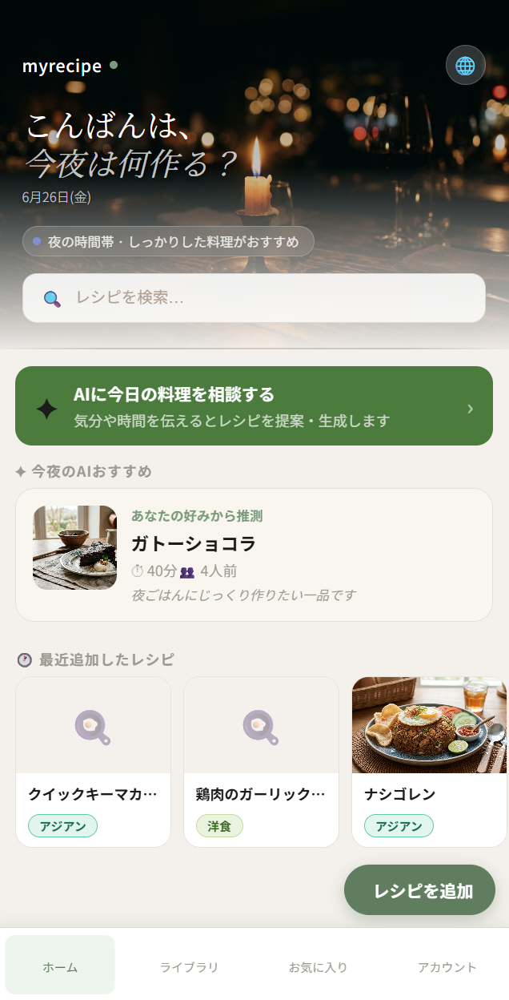
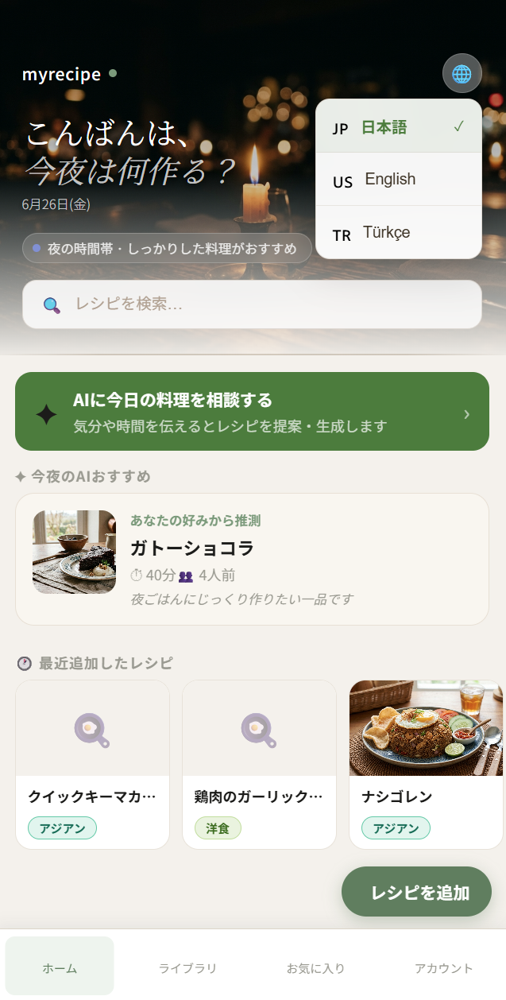
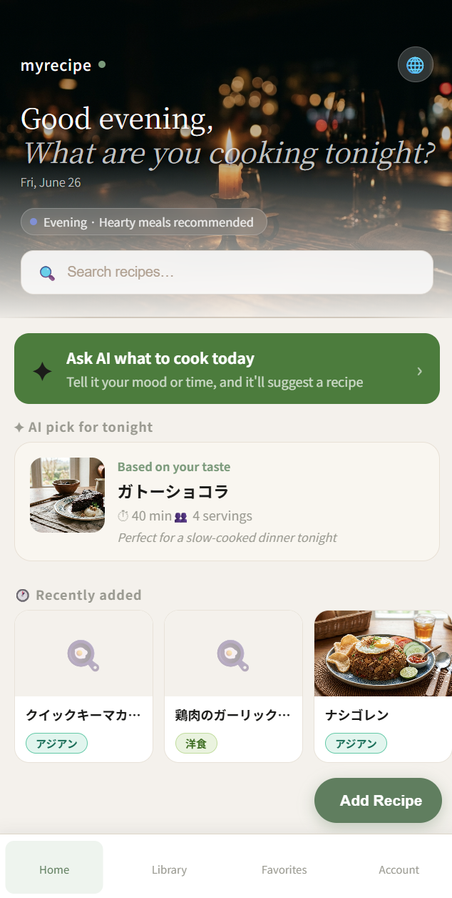
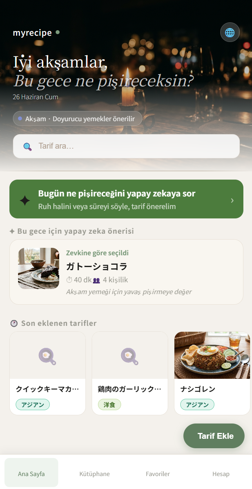

# MyRecipeBook

**自分だけのオリジナルレシピをデジタルで管理する、シンプルで賢いWebアプリ。**

料理写真・材料・手順をまとめて保存し、人数に合わせた分量自動計算・AIアシスタントによる料理サポートを提供します。v4.6では、アプリ全体の多言語対応（日本語・英語・トルコ語）を実装し、ヘッダーの言語切替UIから全ページのラベル・メッセージを即時に切り替えられる状態にしました。

<br>

## スクリーンショット

| ホーム（言語切替前） | 言語切替メニュー |
|:---:|:---:|
|  |  |

| 英語表示 | トルコ語表示 |
|:---:|:---:|
|  |  |

<br>

---

## v4.6 アップデート内容

v4.5ではAIレシピ生成の保存不具合を修正し、コア機能を実用レベルに引き上げました。一方で、アプリ全体は日本語のみのハードコードされた文字列で構成されており、多言語ユーザーへの対応ができていない状態でした。

v4.6では、`react-i18next` を導入し、全11ページ・コンポーネントのハードコード文字列を翻訳キーに置き換え、ヘッダーから日本語・英語・トルコ語をその場で切り替えられるようにしました。

<br>

### 1. i18n基盤の構築

**目的:** UI文字列を言語ごとに分離し、将来的な言語追加もJSONファイルの追加のみで対応できる構成にする。

`react-i18next` / `i18next` / `i18next-browser-languagedetector` を導入し、`src/i18n/index.js` で初期化。検出順序は `localStorage → ブラウザ言語設定 → フォールバック(ja)` とした。

```javascript
i18n
  .use(LanguageDetector)
  .use(initReactI18next)
  .init({
    resources: { ja: { translation: ja }, en: { translation: en }, tr: { translation: tr } },
    supportedLngs: ['ja', 'en', 'tr'],
    fallbackLng: 'ja',
    detection: {
      order: ['localStorage', 'navigator'],
      lookupLocalStorage: 'myrecipe_lang',
      caches: ['localStorage'],
    },
  })
```

<br>

### 2. ヘッダーの言語切替プレースホルダーを実装

**症状:** `HomePage.jsx` のヘッダーにあった田ボタンはクリックしても何も起きないプレースホルダーだった。

**修正内容:** 田ボタンを🌐ボタンに差し替え、タップで日本語 / English / Türkçe を選択できるメニューを実装。選択結果は `localStorage`（`myrecipe_lang`）に保存され、リロード後も保持される。

<br>

### 3. 全ページへの翻訳キー組み込み

**症状:** `HomePage.jsx` 以外の全ページ（ボトムナビ、ライブラリ、お気に入り、ログイン、レシピ詳細、買い物リスト等）が日本語ハードコードのままで、言語を切り替えてもUIが一切変化しなかった。

**原因:** 初期実装では `HomePage.jsx` にのみ `useTranslation()` を組み込んでおり、他コンポーネントは翻訳キーを参照していなかった。

```
HomePage.jsx        → t('...') を使用 → ✅ 切り替わる
BottomNav.jsx        → ハードコード   → ❌ 切り替わらない
LibraryPage.jsx      → ハードコード   → ❌ 切り替わらない
DiscoverPage.jsx     → ハードコード   → ❌ 切り替わらない
（他全ページ同様）
```

**修正内容:** 翻訳JSON（`ja.json` / `en.json` / `tr.json`、3言語×237キー）を全面的に作り直し、`ja.json` を基準に `en.json` / `tr.json` のキー構造を完全に揃えた。あわせて以下11ファイルに `useTranslation()` を組み込み、ハードコード文字列をすべて `t('key')` に置き換えた。

- `BottomNav.jsx`
- `AccountPage.jsx`
- `FavoritesPage.jsx`
- `LoginPage.jsx`
- `RegisterPage.jsx`
- `DiscoverPage.jsx`
- `LibraryPage.jsx`
- `RecipeDetailPage.jsx`
- `ShoppingListPage.jsx`
- `SavedShoppingListPage.jsx`
- `PublicRecipePage.jsx`

なお `RecipeCard.jsx` / `AIPanel.jsx` / `ShareModal.jsx` 等の一部コンポーネントはラベル数が少なく、呼び出し元のPage側で翻訳キーを渡す形で対応したため、個別の改修は不要だった。

<br>

### 4. 翻訳対象外とする項目の明確化

レシピタイトル・カテゴリ名・材料名・手順などはDBから取得するユーザー投稿コンテンツであり、今回の対応範囲では翻訳対象外とした（UIラベルのみを対象とする多言語対応であり、これは設計上の意図的な切り分けである）。

<br>

---

## 技術スタック

- **フロントエンド**: React 18.3 / React Router v6 / Vite 5.4 / Axios 1.7 / vite-plugin-pwa / react-i18next 14 / i18next-browser-languagedetector
- **バックエンド**: FastAPI 0.115 / SQLAlchemy 2.0 / Pydantic v2 / SQLite
- **認証**: passlib（bcrypt） / python-jose（JWT）
- **AI・データ**: ChromaDB / Google Gemini API（gemini-2.5-flash）/ Imagen 3（コメントアウト済み）

<br>

---

## 変更ファイル一覧（v4.5 → v4.6）

### 新規追加

| ファイル | 内容 |
|---|---|
| `src/i18n/index.js` | react-i18next 初期化設定 |
| `src/i18n/locales/ja.json` | 日本語翻訳（基準、237キー） |
| `src/i18n/locales/en.json` | 英語翻訳 |
| `src/i18n/locales/tr.json` | トルコ語翻訳 |

### フロントエンド（既存ファイルの変更）

| ファイル | 変更内容 |
|---|---|
| `main.jsx` | 先頭に `import './i18n'` を追加 |
| `pages/HomePage.jsx` | 田ボタンを🌐言語切替ボタンに変更。全文字列を `t()` に置き換え |
| `components/BottomNav.jsx` | ハードコード文字列を `t()` に置き換え |
| `pages/AccountPage.jsx` | 同上 |
| `pages/FavoritesPage.jsx` | 同上 |
| `pages/LoginPage.jsx` | 同上 |
| `pages/RegisterPage.jsx` | 同上 |
| `pages/DiscoverPage.jsx` | 同上 |
| `pages/LibraryPage.jsx` | 同上 |
| `pages/RecipeDetailPage.jsx` | 同上 |
| `pages/ShoppingListPage.jsx` | 同上 |
| `pages/SavedShoppingListPage.jsx` | 同上 |
| `pages/PublicRecipePage.jsx` | 同上 |

<br>

---

## 既知の課題と対応状況

**RAGの検索精度はレシピ数に依存する（v4.0.1から継続）**

`n_results=4` の指定により、登録レシピが4件未満の場合は類似検索がヒットしない場合があります。10件以上の登録を推奨します。

**メール確認（verification）は未実装**

現在の新規登録は「登録した瞬間にログイン状態になる」簡易フローです。本番運用する場合はメール送信サービスとの連携が今後必要です。

**v4.5以前に保存済みのレシピは材料・手順が空**

マイグレーション適用前に保存されたレシピは `ingredients` / `steps` が空のままです。該当レシピは編集画面から手動で入力するか、AIで再生成・再保存してください。

**レシピ画像は未生成（ポートフォリオ環境）**

Imagen 3 による画像生成は `gemini_client.py` にコメントアウトで実装済みです。本番運用時はコメントアウトを解除し、画像保存先（S3等）を設定することで有効化できます。

**`RecipeFormPage.jsx`（レシピ追加・編集フォーム）は翻訳未対応**

フォームのラベル・バリデーションメッセージが多く、本リリースの一括対応には含めていません。次回アップデートで対応予定です。

**`RecipeListPage.jsx` の多言語対応は保留**

`LibraryPage.jsx` と機能が重複しているページであり、実際のルーティングで使用されているかが不明だったため、本リリースでは対応を保留しています。

**ユーザー投稿コンテンツ（レシピ本文）の言語横断翻訳は対応範囲外**

レシピタイトル・材料・手順などのUGCは、入力された言語のまま保存・表示される仕様です。Cookpadなど大手レシピサービスも言語圏ごとにデータベースを分離して同様の課題を回避しており、機械翻訳による誤訳リスク（特に食材名）を踏まえ、本プロジェクトでは意図的にスコープ外としています。将来対応する場合は、レシピ共有（フォーク）時に翻訳APIを1回だけ適用してキャッシュする設計を想定しています。

<br>

---

## ローカル起動手順

v4.5からの変更点はありません。

```powershell
# ターミナル 1（バックエンド）
cd backend
venv/Scripts/activate
uvicorn main:app --reload

# ターミナル 2（フロントエンド）
cd frontend
npm run dev
```

初回起動時、ヘッダー右上の🌐ボタンから言語を切り替えられます。選択結果はブラウザに保存され、リロード後も保持されます。

<br>

---

## 次期アップデートについて

`RecipeFormPage.jsx`（レシピ追加・編集フォーム）の多言語対応、`RecipeListPage.jsx` の扱いの整理、バージョン表示文字列の更新を予定しています。また、v4.0.1でテスト実装したRAGの `references` フィールドを活用した根拠表示の追加、Imagen 3による画像生成の本番有効化、フォーク数の表示・通知設定の実装も検討しています。

<br>

---

## 開発者について

フルスタック開発・AI連携・認証基盤・UXデザインの実践的な学習を目的に制作している個人開発プロジェクトです。

技術的な質問・フィードバック・コラボレーションのご提案は Issue または Discussions からどうぞ。

<br>

---

## ライセンス

MIT License — 詳細は [LICENSE](LICENSE) をご覧ください。
