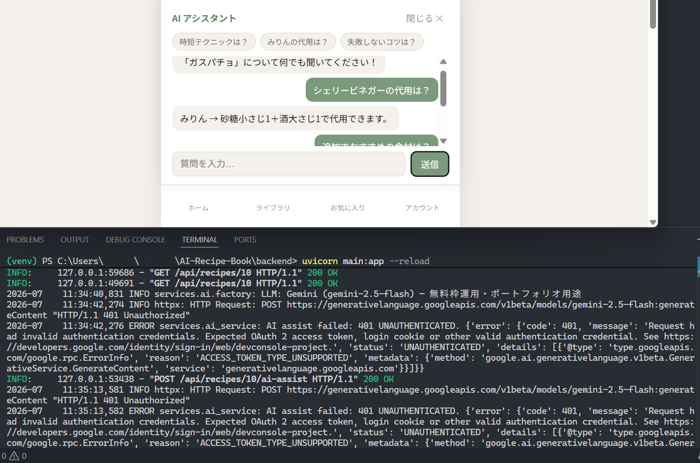
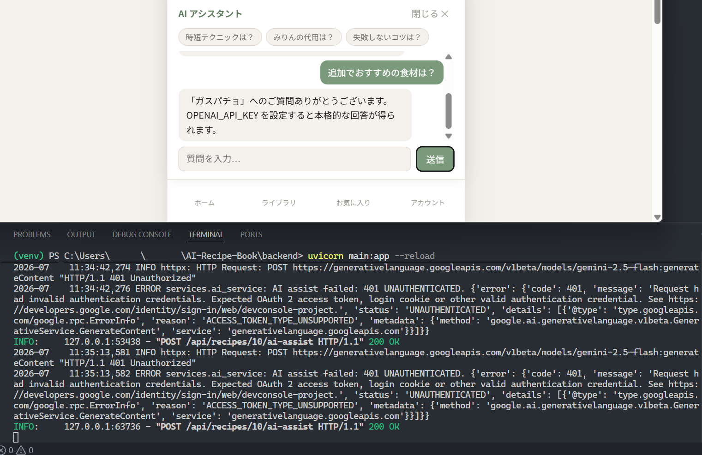
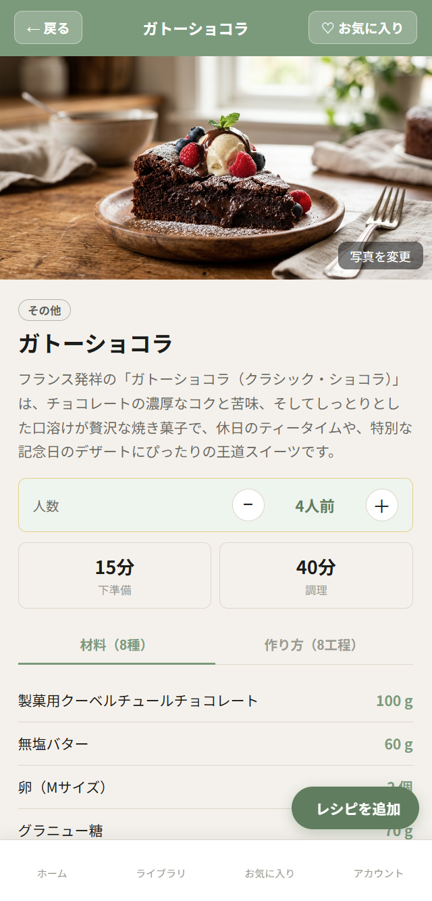

# MyRecipeBook

**自分だけのオリジナルレシピをデジタルで管理する、シンプルで賢いWebアプリ。**


料理写真・材料・手順をまとめて保存し、人数に合わせた分量自動計算・AIアシスタントによる料理サポートを提供します。v5.0では、**公開デモ環境の構築**（Render + Vercel）と、**レシピ個別へのAI質問機能（`ai-assist`）**の実装、そしてアーキテクチャ図・RAG実装解説ドキュメントの整備に取り組みました。

**[公開デモを見る](https://ai-recipe-book-wheat.vercel.app)**（Render無料枠のためコールドスタートで初回表示に数十秒かかる場合があります）

<br>

## 目次

- [更新履歴サマリー](#更新履歴サマリー)
- [v5.0 アップデート内容](#v50-アップデート内容)
- [技術スタック](#技術スタック)
- [設計上の判断メモ](#設計上の判断メモ)
- [既知の課題と対応状況](#既知の課題と対応状況)
- [ローカル起動手順](#ローカル起動手順)
- [次期アップデートについて](#次期アップデートについて)

<br>

---

## 更新履歴サマリー

| バージョン | 概要 |
|---|---|
| **v5.0**（本リリース） | 公開デモ環境（Render + Vercel）構築、レシピ個別AI質問（`ai-assist`）実装、アーキテクチャ図・RAG実例ドキュメント整備 |
| v4.9 | pytestによる自動テスト29件・GitHub Actions CI・DBスキーマ整合性修正（`naming_convention`導入）を実施。品質保証基盤の整備リリース |
| v4.8 | 手書きマイグレーションを**Alembic**に全面移行。SQLite特有の制約対応・動作検証込み |

過去バージョンの詳細は各セクション内の「詳細を見る」から展開できます。

<br>

---

## v5.0 アップデート内容

> **TL;DR:** 公開デモ環境（Render + Vercel）を構築し、実際に触れられる状態で公開。デプロイ過程で発見した実バグ3件を修正。特定レシピへのAI質問エンドポイント（`ai-assist`）を新規実装し、既存のRAG検索（`search-assist`）とは責務が異なることを整理した。あわせてアーキテクチャ図・AI機能デモ解説ドキュメントを整備した。ライブラリ横断RAG検索のフロントUI接続は、次期アップデート以降へ見送った。

<br>

### 1. 公開デモ環境の構築（Render + Vercel）

**構成:** バックエンドをRender（Web Service, 無料枠）、フロントエンドをVercelにデプロイした。

- バックエンド: `https://ai-recipe-book.onrender.com`
- フロントエンド: `https://ai-recipe-book-wheat.vercel.app`

**設計判断 — 新規の課金対策コードは書かない:** AI呼び出しの課金事故を防ぐ仕組みを新規に実装するのではなく、既存の`services/ai/factory.py`のフォールバック機構（APIキー未設定・呼び出し失敗時に自動でmockへ切替）をそのまま安全装置として活用する方針とした。デモ環境は`LLM_PROVIDER=mock`を既定値として運用し、実際のAI生成を見せたい場合のみ一時的に`GEMINI_API_KEY`を設定する運用ルールとした。

**既知の制約:** Renderの無料枠はエフェメラルディスクのため、再起動のたびに画像・DBデータがリセットされうる。これはコスト構造上の制約であり、ポートフォリオ用途としては許容する運用判断とした（恒久対応が必要な場合はPersistent Diskの追加で解消可能）。

詳細な手順は [`docs/deployment.md`](docs/deployment.md) を参照。

<br>

### 2. デプロイ過程で発見した実バグ3件の修正

ローカルでは問題にならなかったが、クリーンなデプロイ環境で顕在化した問題を3件修正した。

| # | 症状 | 原因 | 対応 |
|---|---|---|---|
| 1 | Renderで起動時に`AttributeError` | `main.py`が`settings.upload_dir_str`（文字列）を参照していたが、`config.py`側は`Path`型を返す`upload_dir`プロパティ（`mkdir(exist_ok=True)`込み）に統一済みだった | `settings.upload_dir_str` → `str(settings.upload_dir)` に修正 |
| 2 | Vercel本番でAPI呼び出しがすべて失敗 | `recipeApi.js`の`baseURL`が`'/api'`固定で、ローカル開発時のみ`vite.config.js`の`server.proxy`で機能する構成だった。Vercel/Renderを別ドメインで運用すると、ビルド後は`/api`宛リクエストがVercel自身に飛んで失敗する | 環境変数`VITE_API_BASE_URL`を`baseURL`に反映するよう変更し、本番ではRenderのURLを注入する構成に修正 |
| 3 | 本番フロントからのAPIリクエストがCORSエラーで失敗 | バックエンドのCORS許可オリジンにローカル開発用のURLしか設定されていなかった | 本番オリジン（Vercelのデプロイ先URL）をCORS設定に追加 |

<br>

### 3. レシピ個別へのAI質問エンドポイント（`ai-assist`）の新規実装

**背景:** `services/ai_service.py`にはレシピ単位の質問応答ロジック（`assist()`）がすでに存在していたが、どのルーターからも呼び出されていなかった。

**対応内容:** `routers/recipes.py`に`POST /api/recipes/{recipe_id}/ai-assist`を新設し、対象レシピの材料・レシピ名を`ai_service.assist()`に渡して回答を生成する構成にした。既存の`routers/ai.py`（`/api/ai/*`、ライブラリ横断のdiscover・generate-recipe・search-assist）とはエンドポイントの置き場所を分離し、「特定の1レシピに対する質問」と「ライブラリ横断の検索」という責務の違いをパス構造にも反映させた。

**設計判断 — 材料整形ロジックの重複実装を避ける:** レシピの材料を「食材名 + 分量 + 単位」のテキストに整形する処理は、既に`repositories/vector_repository.py`の`build_recipe_document()`内にインラインで実装されていた。同じロジックを`recipes.py`側に再度書くのではなく、`format_ingredients_text()`として関数化して`vector_repository.py`から切り出し、両方から呼び出す形にリファクタリングした。

```python
# repositories/vector_repository.py
def format_ingredients_text(ingredients: list[dict]) -> str:
    """材料リストを「食材名 + 分量 + 単位」のテキストに整形する（「、」区切り）"""
    parts = []
    for i in (ingredients or []):
        name = i.get("name", "")
        if i.get("amount_text"):
            parts.append(f"{name} {i['amount_text']}")
        elif i.get("amount"):
            parts.append(f"{name} {i['amount']}{i.get('unit', '')}")
        else:
            parts.append(name)
    return "、".join(parts)
```

**動作検証:** ローカルdev環境で、登録済みレシピ（ボンゴレビアンコ／ガスパチョ）に対し「代用品は?」「追加でおすすめの食材は?」等を質問し、`POST /api/recipes/{id}/ai-assist`が`200 OK`を返すことをターミナルログ・UI双方で確認した。

**検証時に発見した副次的な課題:** 検証中、Gemini APIの呼び出しが`401 UNAUTHENTICATED`（`ACCESS_TOKEN_TYPE_UNSUPPORTED`）で失敗し、既存のmockフォールバック機構によって自動的にモック回答へ切り替わっている挙動を確認した。`ai-assist`エンドポイント自体・今回リファクタリングした材料整形ロジックは正常に動作しており影響はないが、Gemini API側の認証設定は別途調査が必要な課題として切り出した（詳細は[既知の課題](#既知の課題と対応状況)を参照）。

<br>

### 4. アーキテクチャ図・AI機能デモ解説ドキュメントの整備

システム全体構成をMermaid図でまとめた[`docs/architecture.md`](docs/architecture.md)と、RAGの仕組み・実際のプロンプト例を実データベースで解説した[`docs/demo_examples.md`](docs/demo_examples.md)を整備した。両ドキュメントとも、登録済みの実レシピ（ボンゴレビアンコ等）を用いた実例に更新済み。

<br>

### 5. スコープ外とした項目 — RAG横断検索（`search-assist`）のフロントUI接続

`POST /api/ai/search-assist`（ライブラリ横断のRAG回答）はバックエンドAPIとして実装済みだが、フロントエンドのUIとはまだ接続されていない。検証の過程でこれが判明したが、簡易的なモーダルやページで妥協して見た目のデモを弱くするのではなく、検索結果一覧・根拠レシピのハイライト表示など、ライブラリ横断検索にふさわしい本格的なUI/UXを設計した上で導入する方針とし、**意図的にv5.0のスコープから除外した。**

<br>

### 6. スクリーンショット

| ライブラリ画面 | AIアシスタント（レシピ個別質問） |
|---|---|
|  |  |

| AIアシスタント（フォールバック応答） | 写真の変更 |
|---|---|
|  |  |

左下の画像は、Gemini APIの認証エラーからmockフォールバックへ自動的に切り替わる様子（[既知の課題](#既知の課題と対応状況)参照）を、実際のターミナルログ込みで確認できるものになっている。

<br>

<details>
<summary><strong>変更ファイル一覧（v4.9 → v5.0）</strong>（クリックで展開）</summary>

| ファイル | 変更内容 |
|---|---|
| `backend/main.py` | `settings.upload_dir_str` → `str(settings.upload_dir)` に修正 |
| `frontend/src/api/recipeApi.js` | `baseURL`を環境変数`VITE_API_BASE_URL`対応に変更 |
| `backend/main.py`（CORS設定） | 本番オリジン（Vercel URL）を許可リストに追加 |
| `backend/repositories/vector_repository.py` | 材料整形ロジックを`format_ingredients_text()`として関数化。`build_recipe_document()`から呼び出す形に変更 |
| `backend/routers/recipes.py` | `POST /{recipe_id}/ai-assist`エンドポイントを新規追加。`format_ingredients_text()`を再利用 |
| `docs/architecture.md`（新規） | システム構成図・レイヤー解説・設計上のアピールポイントを整備 |
| `docs/demo_examples.md`（新規） | RAGの仕組み解説・実データに基づくプロンプト/出力例を整備 |
| `docs/deployment.md`（新規） | Render/Vercelデプロイ手順・環境変数一覧・課金事故防止方針を整備 |
| `docs/PHASE2_SUMMARY.md`（新規） | Phase 2の意思決定記録（モックデータ非重複確認、RAG UI見送りの判断理由等） |
| `docs/Version_4.9/README.md`（新規） | v4.9時点のREADME全文をスナップショットとして退避 |
| `screenshots/`（新規、ルート直下） | v5.0のデモスクリーンショット4枚を配置。次バージョン発表時に`docs/Version_5.0/`へ`README.md`とセットで退避される想定 |

</details>

<br>

---

<details>
<summary><h2 style="display:inline;">v4.9 アップデート内容（クリックで展開）</h2></summary>

> **TL;DR:** 機能追加はなし。pytestによる自動テスト（29件）とGitHub Actions CIを導入し、開発中に発見した3件の潜在バグを修正。あわせてv4.8から持ち越していた`models.py`と実DBスキーマの不整合（外部キー・主キーの無名制約問題）を解消した。

<br>

### 1. 自動テスト（pytest）の導入

**背景:** これまで機能追加のたびに手動でブラウザ・Postman等から動作確認を行っていたが、修正のたびに「他の機能を壊していないか」を確認する仕組みがなかった。

**対応内容:** `backend/tests/` に認証・レシピCRUD・AIアシスタントの3系統を対象とした29件のテストを追加した。

| テストファイル | 件数 | 対象 |
|---|---|---|
| `tests/test_auth.py` | 12件 | 登録・ログイン・パスワード強度・プロフィール更新・パスワード変更 |
| `tests/test_recipes.py` | 10件 | CRUD・所有者分離（他ユーザーのレシピへの404）・お気に入り・公開設定 |
| `tests/test_ai.py` | 6件 | AIアシスタント各エンドポイントの契約テスト（`llm_provider=mock`使用） |
| `tests/conftest.py` | — | テスト用DB分離・認証ヘルパー・外部リソースのモック化 |

**設計判断 — 本番DB・外部サービスへの副作用を完全に分離:**

テストのたびに本番用DB（`recipes.db`）やベクトルDB（ChromaDB）に本物のデータが書き込まれることを防ぐため、以下の二層構造で副作用を遮断している。

- **DBアクセス**：FastAPIの`Depends(get_db)`を、テスト関数ごとに使い捨てる一時SQLiteファイルへ`dependency_overrides`で差し替える
- **DB経由でない外部リソース**（ChromaDBへの`upsert_recipe`等）：`Depends`を通らずモジュール直接呼び出しのため、`monkeypatch`で個別にno-op化

判断基準は「`Depends(get_db)`を通るものは自動的に安全、それ以外の外部リソースは機能追加のたびに個別のモック対応が必要」というルールに整理した（詳細は[設計上の判断メモ](#設計上の判断メモ)を参照）。

<br>

### 2. テスト作成中に発見した3件の実バグ

テストを実際に動かす過程で、クリーンな環境で確実に再現する問題を3件発見し、修正した。

| # | 症状 | 原因 | 対応 |
|---|---|---|---|
| 1 | 起動時に`ImportError` | `routers/auth.py`が`EmailStr`型を使用しているが`email-validator`が`requirements.txt`に未記載 | `email-validator==2.2.0`を追加 |
| 2 | 起動時に`RuntimeError`（`StaticFiles`マウント失敗） | `backend/uploads/`が`.gitignore`対象でクリーンな clone 直後は存在しない | ローカル起動手順に`mkdir uploads`を明記（下記参照） |
| 3 | 登録・ログイン時に`ValueError: password cannot be longer than 72 bytes` | `passlib==1.7.4`と`bcrypt>=4.1`の非互換（passlibが2020年以降実質メンテナンス停止） | `bcrypt==4.0.1`に明示的に固定 |

3件とも「テストを書いて実際に動かして初めて踏んだ」問題であり、コードを目で読むだけでは気づけなかった。

<br>

### 3. GitHub Actions によるCI導入

**対応内容:** `.github/workflows/ci.yml` を追加し、push・PRのたびに以下を自動実行する構成にした。

- **backendジョブ**: `ruff check .` → `pytest`
- **frontendジョブ**: `npm ci` → `npm run build`（ビルドが壊れていないかのスモークテスト）

**設計判断 — 既存コードのlint指摘は無理に一括修正しない:**

CI導入時、既存コードに27件のスタイル上の軽微な指摘（1行に複数ステートメント、未使用importなど、いずれも動作に影響なし）が見つかったが、無関係な範囲まで一括で書き換えるとレビューの見通しが悪くなるため、`backend/pyproject.toml`の`[tool.ruff.lint]`で一時的に許容リスト化した。新規に追加するコードは引き続き厳格にチェックされる。解消は次回アップデートで対応予定（詳細は[既知の課題](#既知の課題と対応状況)を参照）。

<br>

### 4. `models.py`と実DBスキーマの整合性修正

**背景:** v4.8のAlembic導入時に判明していた課題。Alembic導入以前のSQLite上のテーブルは、PRIMARY KEY / FOREIGN KEY制約が無名のまま作られており、将来Alembicがこれらの制約を変更する際に安定した名前で参照できない状態だった。

**対応内容:** `models.py`の`Base.metadata`に`naming_convention`を追加し、PK/FK/UQ/CK/IXすべてに規則的な名前を強制するようにした。

```python
NAMING_CONVENTION = {
    "ix": "ix_%(column_0_label)s",
    "uq": "uq_%(table_name)s_%(column_0_name)s",
    "ck": "ck_%(table_name)s_%(constraint_name)s",
    "fk": "fk_%(table_name)s_%(column_0_name)s_%(referred_table_name)s",
    "pk": "pk_%(table_name)s",
}
```

**SQLiteでの適用方法:** autogenerateは「制約名だけの差分」を検出できないため、`migrations/versions/`に手書きマイグレーションを作成。SQLiteはALTER TABLEで制約名を直接変更できないため、`op.batch_alter_table(table_name, naming_convention=NAMING_CONVENTION, recreate="always")`でテーブルを安全に作り直す方式を採用した。

```python
def upgrade() -> None:
    for table_name in ("users", "recipes", "shopping_lists"):
        with op.batch_alter_table(
            table_name,
            naming_convention=NAMING_CONVENTION,
            recreate="always",
        ):
            pass
```

**検証方法:** naming_convention導入前の状態を再現した「疑似既存DB」（ユーザー・レシピ・買い物リストのデータ入り）を用意し、①`alembic stamp`→②`alembic upgrade head`→③データ保持確認→④`PRAGMA foreign_key_check`による整合性確認→⑤新規ユーザー登録・レシピ作成の一連の動作を確認した。データロス・外部キー違反はなし。

<br>

### 5. デッドコードの削除

上記4の調査過程で、`main.py`に定義されていた手書きマイグレーション関数4つ（`_migrate_add_user_id` / `_migrate_add_profile_columns` / `_migrate_add_sharing_columns` / `_migrate_add_ingredients_steps`）が**どこからも呼び出されていない**ことが判明したため削除した。カラム追加は`Base.metadata.create_all()`（新規インストール時）とAlembicマイグレーション（既存DB移行時）で完結しており、動作への影響がないことをテスト・手動検証の両方で確認済み。

<br>

<details>
<summary><strong>変更ファイル一覧（v4.8 → v4.9）</strong>（クリックで展開）</summary>

| ファイル | 変更内容 |
|---|---|
| `backend/tests/`（新規） | `conftest.py` / `test_auth.py` / `test_recipes.py` / `test_ai.py` を追加（計29テスト） |
| `backend/pytest.ini`（新規） | pytestの実行設定 |
| `backend/pyproject.toml`（新規） | ruffのlint設定。既存コードの軽微な指摘を一時許容 |
| `.github/workflows/ci.yml`（新規） | push/PR時にlint・pytest・フロントエンドbuildを自動実行 |
| `backend/requirements.txt` | `email-validator==2.2.0`を追加。`bcrypt==4.0.1`を明示的に固定 |
| `backend/requirements-dev.txt`（新規） | `pytest` / `httpx` / `ruff` を追加 |
| `backend/models.py` | `Base.metadata`に`naming_convention`を追加 |
| `backend/migrations/versions/e2a5af1a5d75_...py`（新規） | PK/FK制約に名前を付与するマイグレーション |
| `backend/main.py` | 未使用の手書きマイグレーション関数4つを削除。バージョン表記を`4.9.0`に更新 |
| `.gitignore` | テスト実行時の生成物（`test_recipes.db`等）を追加 |

</details>

</details>

<br>

---

<details>
<summary><h2 style="display:inline;">v4.8 アップデート内容（クリックで展開）</h2></summary>

> **TL;DR:** バックエンドのDBスキーマ管理を、手書きの `ALTER TABLE` 方式からAlembicに移行。バージョン管理・ロールバックが可能な構成になった。機能追加はなし。

<br>

### 1. 手書きマイグレーションからAlembicへの移行

**背景:** `main.py` 起動時に `_migrate_add_user_id()` / `_migrate_add_profile_columns()` / `_migrate_add_sharing_columns()` / `_migrate_add_ingredients_steps()` の4関数が `try/except` で `ALTER TABLE` を試みる方式でカラム追加を管理していた。カラムが増えるたびに関数が増殖し、バージョン管理・ロールバックができない状態が課題として蓄積していた。

**対応内容:** Alembicを導入し、`migrations/env.py` にSQLAlchemyの `engine` と `models.Base.metadata` を接続。既存の4関数が追加してきたカラムについては、データ破壊を避けるため `--autogenerate` を使わず、**中身が空（no-op）のbaselineリビジョン**を手書きで作成し、`alembic stamp head` で「現状を基準点として記録」する形で移行した。

```python
def upgrade() -> None:
    # 既存DBはv4.4までの手書きマイグレーションで
    # 既にカラム追加済みのため、ここでは基準点として記録するのみ。
    pass


def downgrade() -> None:
    pass
```

<br>

### 2. SQLite特有の制約への対応（`render_as_batch`）

**症状:** Alembicの `--autogenerate` で生成したマイグレーションを `alembic upgrade head` で適用したところ、以下のエラーで失敗した。

```
sqlite3.OperationalError: near "ALTER": syntax error
[SQL: ALTER TABLE recipes ALTER COLUMN category DROP NOT NULL]
```

**原因:** SQLiteはMySQLやPostgreSQLと異なり、既存カラムの型・制約だけを変更する標準的な `ALTER COLUMN` 文をサポートしていない。

**対応内容:** `migrations/env.py` の `context.configure()` に `render_as_batch=True` を追加し、SQLite向けの「テーブルを再作成してカラム変更を反映する」batch modeを有効化した。

<br>

### 3. 動作確認（カラム追加 → 適用 → ロールバック）

テスト用カラムを用いて、Alembicの一連の流れが正しく機能することを確認した。

```powershell
alembic revision -m "test add nullable column"
alembic upgrade head      # カラムが追加されることを確認
alembic downgrade -1      # カラムが削除され、元の状態に戻ることを確認
```

`PRAGMA table_info` でカラムの追加・削除、`alembic current` でリビジョンの遷移をそれぞれ確認し、ロールバック可能なマイグレーション運用ができる状態になったことを検証した。

<br>

### 4. 副産物として発見した設計上の課題

上記3の過程で、`models.py` のモデル定義（外部キーの `ondelete` 設定、インデックス構成など）と実際のDBの構造との間にズレがあることが判明した。手書きマイグレーションがカラム追加のみを行い、外部キー制約やインデックスまでは反映していなかったことが原因である。特に外部キー制約に名前が付いていないため、SQLiteのbatch modeで `Constraint must have a name` エラーが発生することを確認した。この対応（`naming_convention` の導入含む）は本バージョンの対応範囲外とし、「既知の課題」として次バージョン以降の対応候補とした。

> **v4.9で対応完了。** 詳細は[「v4.9 アップデート内容」](#v49-アップデート内容)を参照。

<br>

<details>
<summary><strong>変更ファイル一覧（v4.7.5 → v4.8）</strong>（クリックで展開）</summary>

| ファイル | 変更内容 |
|---|---|
| `migrations/`（新規） | `alembic init` で生成。`env.py` に `engine` / `Base.metadata` を接続し、`render_as_batch=True` を設定 |
| `migrations/versions/xxxx_baseline_....py`（新規） | 既存スキーマを基準点として記録する空（no-op）のbaselineリビジョン |
| `alembic.ini`（新規） | `sqlalchemy.url` はハードコードせず `.env` の `DATABASE_URL` から読み込む構成に変更 |
| `main.py` | `_migrate_add_user_id()` / `_migrate_add_profile_columns()` / `_migrate_add_sharing_columns()` / `_migrate_add_ingredients_steps()` の定義・呼び出しを削除 |
| `requirements.txt` | `alembic` を追加 |
| `README.md` | Alembic移行の内容を追記。ローカル起動手順に `alembic upgrade head` を追加 |

</details>

</details>

<br>

---

<details>
<summary><h2 style="display:inline;">v4.7.5 アップデート内容（クリックで展開）</h2></summary>

> **TL;DR:** 機能追加は行わず、依存関係の整合・セキュリティ警告追加・デッドコード削除などコードベースの健全性を高めた保守リリース。

<br>

### 1. `requirements.txt` の依存関係整合

**背景:** 実際の動作に必要なパッケージが `requirements.txt` に記載されておらず、`pip install -r requirements.txt` だけでは起動できない状態になっていた。

**修正内容:** 以下のパッケージを追加し、`pip install -r requirements.txt` で環境を完全に再現できる状態にした。

| 追加パッケージ | 用途 |
|---|---|
| `pydantic-settings` | `config.py` の `BaseSettings` に必要 |
| `passlib[bcrypt]` | パスワードハッシュ（認証） |
| `python-jose[cryptography]` | JWT 署名・検証（認証） |
| `google-generativeai` | Gemini API 連携 |
| `chromadb` | RAG 機能のベクトルDB |

<br>

### 2. デフォルト `SECRET_KEY` の起動時警告

**背景:** `config.py` の `secret_key` がデフォルト値 `"CHANGE_THIS_IN_PRODUCTION"` のまま起動された場合、`.env` の設定漏れに気づけずセキュリティリスクになる可能性があった。

**修正内容:** Pydantic v2 の `model_post_init` フックを利用し、デフォルト値のまま起動した場合に警告ログを出力するようにした。

```python
def model_post_init(self, __context):
    if self.secret_key == "CHANGE_THIS_IN_PRODUCTION":
        import logging
        logging.warning(
            "⚠️  SECRET_KEY がデフォルト値のままです。"
            " .env に SECRET_KEY を設定してください。"
        )
```

<br>

### 3. `RecipeListPage.jsx` の削除（デッドコード整理）

**背景:** `LibraryPage.jsx` と機能が重複しているページとして「既知の課題」に記録されていたが、実際に使用されているかが未確認のまま保留になっていた。

**検証方法:** PowerShell の `Get-ChildItem` と `Select-String` を組み合わせ、プロジェクト全体の `.jsx` ファイルを対象に `"RecipeListPage"` を検索した。

```powershell
Get-ChildItem -Recurse -Filter "*.jsx" src/ | Select-String "RecipeListPage"
```

**結果:** ヒットしたのは `RecipeListPage.jsx` 自身の定義行のみ。`App.jsx` のルート登録・他ページからの `import` がいずれも存在しないことが確認され、完全なデッドコードと判断した。

**対応:** ファイルを削除し、README・リリースノートの「保留」記述も合わせて整理した。

<br>

### 4. README「設計上の判断メモ」セクションを追加

`tCat` / `tUnit` ヘルパーが各コンポーネントに個別定義されている現状について、DRY 原則の観点から将来の改善方針とともに記録した。

<br>

**変更ファイル一覧（v4.7 → v4.7.5）**

| ファイル | 変更内容 |
|---|---|
| `requirements.txt` | `pydantic-settings` / `passlib[bcrypt]` / `python-jose[cryptography]` / `google-generativeai` / `chromadb` を追加 |
| `backend/config.py` | `model_post_init` でデフォルト `SECRET_KEY` 使用時の起動警告を追加 |
| `pages/RecipeListPage.jsx` | 未使用と確認の上、削除 |
| `README.md` | 設計上の判断メモ（`tCat` / `tUnit` の DRY 原則に関する記述）を追加。`RecipeListPage.jsx` 関連の保留記述を削除 |

</details>

<br>

<details>
<summary><h2 style="display:inline;">v4.7 アップデート内容（クリックで展開）</h2></summary>

> **TL;DR:** レシピ作成フォームのラベル、料理カテゴリ・分量単位の表示を含め、UI全体の多言語対応（日本語／英語／トルコ語）を完成させたリリース。

<br>

v4.6でアプリ全体のUI文字列を多言語化しましたが、以下の3点が未対応のままでした。

- `RecipeFormPage.jsx`（レシピ追加・編集フォーム）のラベル・バリデーションメッセージが日本語ハードコードのまま
- 料理カテゴリ（「和食」「中華」など）がどの言語に切り替えてもDB保存値の日本語表記で表示される
- 分量の単位（「枚」「束」など）が同様に日本語表記のまま表示される

v4.7ではこれら3点をすべて解消し、レシピ作成から閲覧・買い物リストまでの全画面で表示の一貫性を確保しました。

<br>

### 1. `RecipeFormPage.jsx` の多言語対応

**症状:** レシピを新規作成・編集するフォーム画面のラベル・プレースホルダー・バリデーションメッセージ・ボタン文字列がすべて日本語ハードコードのままで、言語を切り替えても一切変化しなかった。

**修正内容:** `useTranslation()` を導入し、`recipeForm.*` 名前空間に40キーの翻訳定義を追加。フォーム内のすべての文字列を `t()` に置き換えた。

対応した主な箇所は以下のとおり。

| 箇所 | 変更前（日本語固定） | 変更後 |
|---|---|---|
| ページタイトル | 「新しいレシピ」「レシピを編集」 | `t('recipeForm.pageNew')` / `t('recipeForm.pageEdit')` |
| セクション見出し | 「📋 基本情報」「🥕 材料」「📝 作り方の手順」など | `t('recipeForm.sectionBasic')` など |
| フォームラベル | 「料理名 *」「カテゴリ」「基準の人数」など | `t('recipeForm.titleLabel')` など |
| 材料モード切替 | 「数値」「文字」 | `t('recipeForm.ingModeNum')` / `t('recipeForm.ingModeText')` |
| 換算バッジ | 「↕ 換算あり」「固定表示」 | `t('recipeForm.ingUnitScaled')` / `t('recipeForm.ingFixed')` |
| テキストモード注意書き | 「…そのまま固定表示されます…」 | `t('recipeForm.ingTextNote')` （`<strong>` 箇所も言語別に定義） |
| 工程ラベル | 「工程 1」「工程 1 の説明を入力」 | `t('recipeForm.stepLabel', { number: 1 })` |
| ボタン | 「保存中…」「変更を保存」「レシピを登録」「キャンセル」 | `t('recipeForm.saving')` など |
| エラーメッセージ | 「料理名を入力してください」「保存に失敗しました」など | `t('recipeForm.errorTitle')` など |

<br>

### 2. 料理カテゴリの多言語表示対応

**症状:** 「和食」「洋食」「中華」などのカテゴリ名が、英語・トルコ語に切り替えても日本語表記のまま表示されていた。レシピ作成フォームのカテゴリ選択ボタン、レシピ詳細・公開レシピページのカテゴリバッジ、AIレシピ生成プレビューのカテゴリバッジで同様の問題が発生していた。

**設計判断 — DBの保存値は変更しない:**

カテゴリ名はDB上では `"和食"` `"中華"` という日本語文字列のまま保存されている。これを `"japanese"` `"chinese"` などの言語中立なキーに変更する方針もあったが、以下の理由から保存値は変えず、表示時だけ翻訳マップを通す設計を採用した。

- 既存レシピデータへのマイグレーションが不要になる
- バックエンドのバリデーションロジックを変更せずに済む
- カテゴリは選択肢が固定の閉じたリストであり、DBキーが日本語であっても翻訳マップが破綻しない
- ポートフォリオ規模のプロジェクトに対してスキーマ変更はオーバーエンジニアリングである

**実装方法:**

```javascript
// 各コンポーネントで1行追加するだけ
const tCat = (key) => t(`categories.${key}`, { defaultValue: key })

// 使用例（DBキー"和食"のまま保存・表示は言語別に変換）
<span className={`cat-badge cat-${recipe.category}`}>
  {tCat(recipe.category)}
</span>
```

`defaultValue: key` を指定しているため、翻訳マップに存在しないキーが来た場合でも元の日本語文字列がフォールバックとして表示され、エラーにならない。

**対応ファイル:** `RecipeFormPage.jsx` / `RecipeDetailPage.jsx` / `PublicRecipePage.jsx` / `DiscoverPage.jsx`

<br>

### 3. 分量単位の多言語表示対応

**症状:** 「枚」「束」「片」などの単位表記が、英語・トルコ語に切り替えても日本語表記のまま表示されていた。レシピ作成フォームの単位セレクト、買い物リスト（入力モード・リストモード）、保存済み買い物リスト、ライブラリの買い物リストプレビューで同様の問題が発生していた。

**設計判断 — DBの保存値は変更しない:**

カテゴリと同じ理由により、DB上の保存値（`"枚"` `"束"` など）は変更せず、表示時のみ翻訳マップを通す設計を採用した。単位はカテゴリ以上に既存データとの整合が重要であり（分量計算時に保存値を直接参照するロジックが存在するため）、保存値を変更するリスクは特に高い。

**実装方法:**

```javascript
const tUnit = (key) => t(`units.${key}`, { defaultValue: key })

// 使用例（DB値"枚"のまま保存・表示は "slice(s)" / "dilim" 等に変換）
<option key={u} value={u}>{tUnit(u)}</option>
```

**対応ファイル:** `RecipeFormPage.jsx` / `ShoppingListPage.jsx` / `SavedShoppingListPage.jsx` / `LibraryPage.jsx`

<br>

### 4. レシピ本文（工程・材料名）の自動翻訳は対応範囲外とした理由

レシピの工程・説明文・材料名はユーザーが任意の言語で自由記述するコンテンツであり、UIラベルとは性質が根本的に異なる。本バージョンでの実装を断念した理由は以下のとおり。

**翻訳品質の問題:** 料理の工程文には「炒める」「ひとつまみ」「面取り」のような調理用語が多く、汎用翻訳APIでは誤訳・不自然な表現が生じやすい。誤った調理手順が表示されることはUXの毀損に直結する。

**コスト・アーキテクチャの問題:** 表示のたびに翻訳APIを呼ぶ構成では通信コストとレスポンス遅延が発生する。DBに多言語カラムを持つ構成ではスキーマ変更と既存データの一括マイグレーションが必要になる。どちらもポートフォリオ規模のアプリに対してオーバーエンジニアリングである。

**サービス設計上の一般慣行:** CookpadやRecipetin Japanなど実際のレシピサービスも、ユーザー投稿コンテンツは投稿言語のまま表示し、UIのみを多言語化する設計を採用している。

以上の理由から、**レシピ本文は入力言語のまま表示し、UIのみ多言語化する**設計としている。将来対応する場合は、レシピ共有（フォーク）時に翻訳APIを1回だけ適用してDBにキャッシュする設計が現実的と考える。

<br>

**変更ファイル一覧（v4.6 → v4.7）**

翻訳JSONの更新：

| ファイル | 変更内容 |
|---|---|
| `src/i18n/locales/ja.json` | `categories.*`（7キー）・`units.*`（24キー）・`recipeForm.*`（40キー）を追加 |
| `src/i18n/locales/en.json` | 同上（英語訳） |
| `src/i18n/locales/tr.json` | 同上（トルコ語訳） |

フロントエンド（既存ファイルの変更）：

| ファイル | 変更内容 |
|---|---|
| `pages/RecipeFormPage.jsx` | `useTranslation()` を導入。全ラベル・バリデーション・ボタンを `t()` に置き換え。カテゴリボタン・単位セレクトを `tCat()` / `tUnit()` 経由に変更 |
| `pages/RecipeDetailPage.jsx` | カテゴリバッジの表示を `tCat()` 経由に変更 |
| `pages/PublicRecipePage.jsx` | 同上 |
| `pages/DiscoverPage.jsx` | AIレシピ生成プレビューのカテゴリバッジを `tCat()` 経由に変更 |
| `pages/ShoppingListPage.jsx` | 必要量・手持ち量・購入量の単位表示を `tUnit()` 経由に変更 |
| `pages/SavedShoppingListPage.jsx` | 購入リストの単位表示を `tUnit()` 経由に変更 |
| `pages/LibraryPage.jsx` | ショッピングリストプレビューの単位タグを `tUnit()` 経由に変更 |

</details>

<br>

---

## 技術スタック

- **フロントエンド**: React 18.3 / React Router v6 / Vite 5.4 / Axios 1.7 / vite-plugin-pwa / react-i18next 14 / i18next-browser-languagedetector
- **バックエンド**: FastAPI 0.115 / SQLAlchemy 2.0 / Pydantic v2 / SQLite / **Alembic**
- **認証**: passlib（bcrypt） / python-jose（JWT）
- **AI・データ**: ChromaDB / Google Gemini API（gemini-2.5-flash）/ Imagen 3（コメントアウト済み）
- **テスト・品質管理**: pytest / httpx / ruff / **GitHub Actions（CI）**
- **デプロイ**: Render（バックエンド）/ Vercel（フロントエンド）

<br>

---

## 設計上の判断メモ

### RAG横断検索（`search-assist`）のフロントUI接続を見送った理由

v5.0の検証過程で、`POST /api/ai/search-assist`がバックエンドAPIとしては実装済みである一方、フロントエンドのどの画面からも呼ばれていないことが判明した。最小限のモーダルなどで簡易的に繋ぎ込むことも可能だったが、ライブラリ横断検索は「検索結果一覧」「根拠レシピのハイライト表示」など、単発のレシピ質問（`ai-assist`）とはUI/UXの性質が異なる機能であるため、次期アップデート以降で腰を据えて設計する方針とした。

### レシピ個別AI質問（`ai-assist`）と横断RAG検索（`search-assist`）の責務分離

両者は同じ`ai_service.py`のAIオーケストレーションを利用するが、対象範囲が異なる。`ai-assist`は「今開いている1つのレシピ」に閉じた質問応答であり`routers/recipes.py`に配置し、`search-assist`は「登録済みレシピ全体」を検索対象とするため`routers/ai.py`（`/api/ai/*`）に配置している。エンドポイントのパス構造自体に、この責務の違いを反映させた。

### 材料整形ロジックの共通化について

`ai-assist`実装にあたり、材料リストを「食材名 + 分量 + 単位」のテキストに整形する処理が`vector_repository.py`の`build_recipe_document()`内に既に存在していることを確認した。同じロジックを`routers/recipes.py`側に再実装するのではなく、`format_ingredients_text()`として関数化して切り出し、両方から呼び出す形にした。`tCat`/`tUnit`（v4.7で導入）が現時点でもページごとに同じ1行を個別定義している状態であるのに対し、今回は最初から共通関数として設計した点が異なる。

### `tCat` / `tUnit` の配置について

カテゴリ翻訳ヘルパー `tCat` と単位翻訳ヘルパー `tUnit` は、現時点では各ページコンポーネント内に同じ1行を個別に定義しています（DRY 原則の観点では共通フックへの切り出しが理想的な形です）。

```javascript
const tCat  = (key) => t(`categories.${key}`, { defaultValue: key })
const tUnit = (key) => t(`units.${key}`,      { defaultValue: key })
```

将来的には `hooks/useRecipeTranslation.js` として共通化し、翻訳ロジックの変更が1箇所で完結する構造に移行することを検討しています。現バージョンではページ数が限定的で影響範囲が把握しやすいため、可読性を優先して現状の形を維持しています。

### マイグレーション管理について

v4.7.5までは `main.py` 起動時に `_migrate_add_*()` 関数群が `ALTER TABLE` を試みる方式でマイグレーションを管理していましたが、v4.8で **Alembic** に移行しました。その過程で判明していた「`models.py`と実DBスキーマの外部キー・主キーが無名である」という課題は、v4.9で `naming_convention` の導入とbatch modeによるテーブル再作成で解消しています。

### テストにおける副作用の切り離し方針

自動テストを書く際、「本番用DBやベクトルDB・外部AI APIに実際の副作用が及ばないこと」をテスト設計の大前提としています。判断基準は次の通りです。

- **`Depends(get_db)`経由のDBアクセス**：FastAPIの`dependency_overrides`でテスト用の使い捨てDBに丸ごと差し替えれば、機能追加のたびに個別対応する必要なく自動的に安全になる
- **それ以外の外部リソース**（ChromaDBへの直接呼び出し、外部AI APIなど）：`Depends`を経由しないため、機能を追加するたびに`monkeypatch`等で個別にモック化する必要がある（本アプリでは`llm_provider=mock`をデフォルト値にすることでAI API呼び出し自体も安全にしている）

新しく「検索履歴」のようなDB書き込み機能を追加する場合も、このルールに沿って設計すれば既存のテスト基盤がそのまま適用できます。

### lintルールの段階的な適用について

v4.9でCIにruffを導入した際、既存コードに27件のスタイル上の軽微な指摘（動作に影響のないもの）が見つかりました。無関係な範囲まで一括で書き換えるとレビューの見通しが悪くなるため、`backend/pyproject.toml`の`ignore` / `per-file-ignores`で意図的に一時許容し、新規追加コードのみ厳格にチェックする方針としています。この許容リストは将来的に空にすることを目指しています。

<br>

---

## 既知の課題と対応状況

**Gemini APIの認証エラー（`401 UNAUTHENTICATED` / `ACCESS_TOKEN_TYPE_UNSUPPORTED`）**

v5.0で`ai-assist`の動作検証中に発見した課題。Gemini API呼び出しが認証エラーで失敗し、既存のmockフォールバック機構により自動的にモック回答へ切り替わっている（アプリとしては壊れておらず、モック回答で機能提供を継続できている）。APIキーの設定方式（APIキー認証 vs OAuth）に起因すると推測されるが、原因調査・恒久対応はPhase 3以降のデバッグタスクとして持ち越す。

**RAG横断検索（`search-assist`）のフロントUI未接続**

バックエンドAPI（`POST /api/ai/search-assist`）は実装済みで動作確認も可能だが、フロントエンドUIは未接続。簡易的なUIで妥協するのではなく、ライブラリ横断検索にふさわしい本格的なUI/UXを設計した上でPhase 3以降に導入する方針とし、v5.0のスコープからは意図的に除外した。

**Renderの無料枠によるデータの一時性**

Render無料枠はエフェメラルディスクのため、再起動のたびに画像・DBデータがリセットされうる。ポートフォリオ用途としては許容する運用判断としている。

**メール確認（verification）は未実装**

現在の新規登録は「登録した瞬間にログイン状態になる」簡易フローです。メール確認フローを実装するにはSendGridやAWS SESなどのメール送信サービスとの連携が必要になります。外部サービスの利用コストと、ポートフォリオ用途のアプリであるという位置づけのトレードオフを考慮した上で、現時点では実装を見送っています。

**レシピ画像の自動生成は保留（ポートフォリオ環境）**

Imagen 3 による画像自動生成は `gemini_client.py` にコメントアウトで実装済みです。画像生成APIの利用はリクエストごとにコストが発生するため、ポートフォリオ環境での常時有効化は行っていません。本番運用時はコメントアウトを解除し、画像保存先（S3等）を設定することで有効化できます。

**ユーザー投稿コンテンツ（レシピ本文）の言語横断翻訳は対応範囲外**

レシピタイトル・材料名・手順などのUGCは、入力された言語のまま保存・表示される仕様です。断念の詳細な理由は`docs/Version_4.9/README.md`内の「v4.7 アップデート内容」を参照してください。

**既存コードのlint指摘（27件）は一時許容中**

v4.9でCI導入時に発見した軽微なスタイル指摘（1行に複数ステートメント、未使用importなど）です。動作への影響はありませんが、`pyproject.toml`のignoreリストで一時的に許容しています。次回アップデートでの解消を予定しています。

<br>

---

## ローカル起動手順

v5.0での変更はありません（バックエンド／フロントエンドの起動手順自体はv4.9から変わらず）。

```powershell
# ターミナル 1（バックエンド）
cd backend
venv\Scripts\Activate.ps1
pip install -r requirements.txt
mkdir uploads   # 初回のみ。.gitignore対象のため clone 直後は存在しない
alembic upgrade head
uvicorn main:app --reload

# ターミナル 2（フロントエンド）
cd frontend
npm run dev
```

**テストの実行:**

```powershell
cd backend
pip install -r requirements-dev.txt
pytest          # 自動テスト（29件）を実行
ruff check .    # lintチェック
```

ヘッダー右上の🌐ボタンから言語を切り替えられます。選択結果はブラウザに保存され、リロード後も保持されます。

公開デモ環境の構築手順（Render / Vercel）は[`docs/deployment.md`](docs/deployment.md)を参照してください。

<br>

---

## 次期アップデートについて

Gemini API認証エラー（`401 UNAUTHENTICATED`）の原因調査・恒久対応、RAG横断検索（`search-assist`）の本格的なフロントUI実装を次のアップデートで予定しています。あわせて、v4.9で一時許容とした既存lint指摘の解消、バックエンド／フロントエンドのエラーハンドリングの体系化、APIドキュメント（Swagger）の整備にも取り組む予定です。フォーク数の表示・通知設定、Imagen 3による画像生成の本番有効化も引き続き検討しています。

<br>

---

## 開発者について

フルスタック開発・AI連携・認証基盤・UXデザインの実践的な学習を目的に制作している個人開発プロジェクトです。

技術的な質問・フィードバック・コラボレーションのご提案は Issue または Discussions からどうぞ。

<br>

---

## ライセンス

MIT License — 詳細は [LICENSE](LICENSE) をご覧ください。
